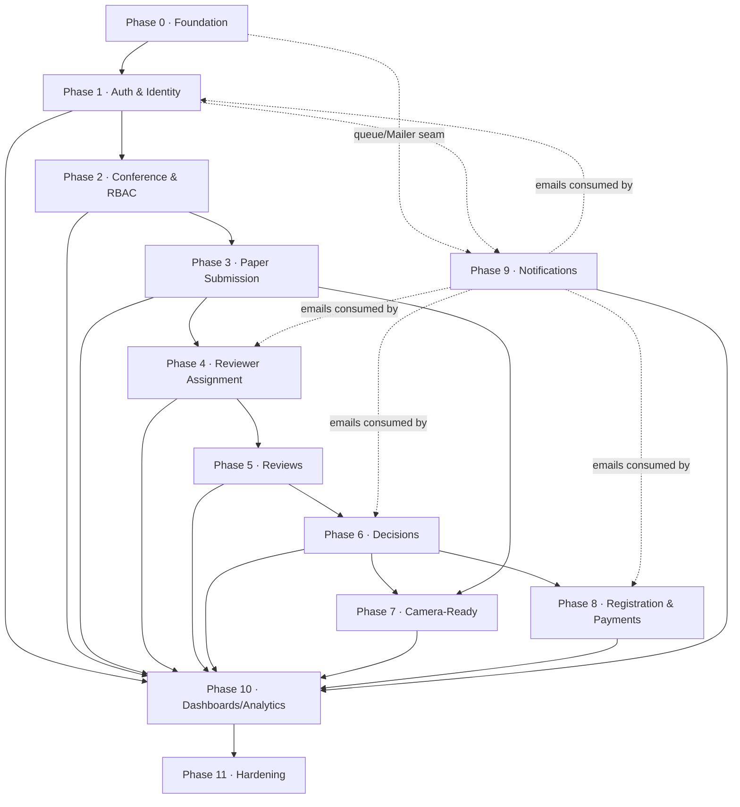

# OpenConferences — Implementation Roadmap

> Companion to `SYSTEM_DESIGN.md` (v2). This document is the engineering delivery plan: the order in which we build, why that order minimizes risk and refactoring, and how we know each phase is done. Section references like §5 point into the system design.

> **Authoring stance:** written as the plan a senior team would execute. It favors **vertical slices** (working user workflows) over horizontal modules, the shortest path to running software, and foundations that prevent expensive rework. Where multiple orderings exist, the trade-off is stated and a recommendation given.

---

## How to read this document

- **Phase 0** is pure foundation — no business logic, but everything that makes business logic cheap and safe to write.
- **Phases 1–11** each ship a coherent capability. Each phase lists: Objective, Business Value, Modules, Frontend/Backend/Database/API/Testing/Security/Deployment tasks, Definition of Done, Estimated Complexity, Dependencies, and Risks.
- The **Walking Skeleton**, **Dependency Graph**, **Milestones**, and **Production Checklist** follow the phases.
- **Complexity** is given in T-shirt sizes (S/M/L/XL) plus a rough engineer-week range for a 2–3 person team. These are planning estimates, not commitments.

### Cross-cutting principles (apply to every phase)

1. **Vertical slices, not horizontal layers.** Never "build the whole DB, then the whole API, then the whole UI." Build the thinnest end-to-end path that a real user can exercise, then widen it.
2. **Contracts before code.** Each feature starts with its Zod schema + ts-rest contract in `packages/contracts`. Frontend and backend build against the same typed contract, so integration bugs surface at compile time.
3. **Invariants live in the service layer and the database.** Guards authorize; services enforce scope/COI/money rules; the DB enforces uniqueness/FKs/RLS. No business rule lives only in the UI.
4. **Every money/state mutation is concurrency-safe from day one** (optimistic `version`, `FOR UPDATE` where needed). Retrofitting locking is the most expensive refactor — we never defer it.
5. **Tests track risk, not coverage vanity.** Auth, authorization/IDOR, payments, and review COI get integration tests early; CRUD gets lighter coverage.

---

## Phase 0 — Project Foundation

**Objective.** Stand up the monorepo, toolchain, local infrastructure, and the cross-cutting plumbing (config, logging, error handling, validation, CI) so that the _first line of business logic_ is written into a safe, observable, reproducible environment.

**Business value.** None directly shippable — but every Phase-0 task is something that is **10× cheaper to do before code exists than after**. Choosing Git strategy, error envelope, and config loading once prevents dozens of inconsistent retrofits later. This is the "measure twice, cut once" phase.

### Why every task belongs in Phase 0

| Task                                                  | Why it must precede business logic                                                                                                                               |
| ----------------------------------------------------- | ---------------------------------------------------------------------------------------------------------------------------------------------------------------- |
| **Monorepo (pnpm + Turborepo)**                       | The shared `schemas`/`contracts`/`db` packages are imported by every later phase. If apps are wired up ad hoc, the type-safety story (§16.2) never materializes. |
| **Folder structure & module conventions**             | NestJS module boundaries map 1:1 to bounded contexts (§3.1, §7). Establishing the skeleton now means every feature lands in the right seam.                      |
| **Coding standards, lint, format**                    | Enforced by CI from commit #1, so style is never a review topic and diffs stay clean. Retro-formatting a large codebase pollutes git blame.                      |
| **Git strategy**                                      | Branch/PR/commit rules decide how all future work merges. Picking it after 10 contributors have habits is painful.                                               |
| **Docker Compose (Postgres, Redis, MinIO)**           | Local-equals-prod (§17) requires the same backing services. Without this, "works on my machine" bugs appear in every phase.                                      |
| **Environment & config management**                   | Typed, validated config (fail-fast on boot) prevents an entire class of prod incidents. Every later module reads config; the loader must exist first.            |
| **Secrets management**                                | Establishing "secrets never in git, injected via env/Coolify" before any key exists prevents the classic committed-credential leak.                              |
| **Database setup + Prisma + migration flow**          | The migration discipline (one source of truth, forward-only in prod) underpins every schema change in Phases 1–8.                                                |
| **Logging (structured, request-scoped)**              | Pino + correlation IDs must be in the request pipeline before features generate logs, or you bolt on observability blind.                                        |
| **Error handling (global filter + error envelope)**   | The RFC-7807-style problem envelope (§8) is what every API returns. Defining it once means clients (and tests) rely on a stable shape.                           |
| **Validation (Zod + ts-rest pipe)**                   | Input validation at the boundary is a security control, not a feature. It must wrap the first endpoint.                                                          |
| **Testing framework (Vitest + Playwright + test DB)** | A green pipeline from day one keeps the project releasable continuously; adding tests late means low coverage forever on the riskiest early code.                |
| **CI/CD pipeline**                                    | Lint + typecheck + test + build on every PR. Catches regressions while the codebase is small enough to fix them cheaply.                                         |

### Modules / packages created

```
openconferences/
  apps/web         apps/api         apps/worker
  packages/schemas packages/contracts packages/db packages/config
  infra/           .github/workflows/
  docker-compose.yml
```

### Tasks

- **Repo & tooling:** init pnpm workspace + Turborepo; TypeScript project references; ESLint + Prettier + `lint-staged` + Husky pre-commit; commitlint (Conventional Commits); `.editorconfig`.
- **Git strategy:** trunk-based with short-lived feature branches; PRs require green CI + 1 review; squash-merge; protected `main`; release tags `vX.Y.Z`. (Recommended over GitFlow: this is a small team shipping continuously — long-lived branches add merge pain with no benefit.)
- **Local infra:** `docker-compose.yml` with Postgres 16, Redis 7, MinIO; seed script; Makefile/`pnpm` task shortcuts (`db:migrate`, `db:seed`, `dev`, `test`).
- **Config:** `packages/config` exporting a Zod-validated env loader; `.env.example`; fail-fast on missing/invalid vars; separate `test`/`dev`/`prod` profiles.
- **DB:** `packages/db` with Prisma; baseline migration (empty + extensions: `pgcrypto`/`uuid-ossp`, `pg_stat_statements`); migration runbook (forward-only in prod, `prisma migrate deploy` in CI/CD).
- **API skeleton:** NestJS bootstrap; global `ValidationPipe` (Zod via ts-rest); global exception filter emitting the problem envelope; Pino logger module with request-id middleware; health/readiness endpoints (`/healthz`, `/readyz`).
- **Web skeleton:** Next.js App Router; Tailwind + shadcn/ui; ts-rest typed client wired to API; root layout, error boundary, 404.
- **Worker skeleton:** pg-boss bootstrap against Postgres; a no-op job to prove enqueue→consume works end to end.
- **CI/CD:** GitHub Actions — install (cached) → lint → typecheck → unit/integration (against a throwaway Postgres service) → build. Deploy workflow (manual approval) to Coolify for `api`/`web`/`worker` images.
- **Observability baseline:** Sentry SDK wired (no-op DSN locally); structured request logs; basic Prometheus/OTel hooks stubbed.

### Testing tasks

- Vitest config shared across packages; one example unit test + one Nest integration test hitting `/healthz` against the test DB; Playwright smoke test that loads the web root. CI must run all three.

### Security tasks

- Secrets only via env (documented); `helmet`/security headers middleware; CORS allowlist; dependency audit (`pnpm audit`) in CI; confirm **TanStack Query excluded** (§16.3) and lockfile committed.

### Deployment tasks

- Dockerfiles for `api`, `web`, `worker` (multi-stage, non-root user); Coolify project with three services + managed Postgres + Redis connection strings as secrets; staging environment reachable behind Cloudflare.

### Definition of Done

- `pnpm dev` brings up web+api+worker against Dockerized PG/Redis/MinIO.
- A PR runs the full CI pipeline green.
- `/healthz` and `/readyz` return 200; a no-op pg-boss job is enqueued and consumed; a log line carries a request id; a forced error returns the standard problem envelope.
- Staging deploy of the skeleton succeeds via Coolify behind Cloudflare.

### Estimated complexity

**L** (~1.5–2.5 engineer-weeks). High leverage; do not rush the config/error/migration conventions.

### Dependencies

None (this is the root).

### Risks

- _Over-engineering the foundation_ (gold-plating CI, premature abstractions) — timebox it; the skeleton must stay thin.
- _Toolchain churn_ (Turborepo/Prisma version drift) — pin versions, commit lockfile.
- _Skipping the worker/queue smoke test_ — defers discovery of the trickiest infra wiring; do it now.

---

## Phase 1 — Authentication & Identity

**Objective.** Ship complete, secure authentication and the **RBAC foundation** (global `User` + the scaffolding for conference-scoped roles), including email verification, password reset, session management, and MFA hooks for privileged roles.

**Business value.** Nothing in the product is usable without identity. This phase also locks in the single most security-sensitive surface; getting it right early prevents a rewrite once data exists. It de-risks the §15 global-identity decision by proving it in code.

**Modules.** `Identity` (User, Account, Session), foundational `Tenancy` types for roles (`Membership`, `RoleGrant` schema present even if grant UI comes in Phase 2), Better Auth integration.

### Database tasks

- Tables: `users`, `accounts`, `sessions`, `email_verification_tokens`, `password_reset_tokens`; enums for `role` and `membership_scope` (§4). UUIDv7 generated in app; `version` column convention applied where mutable.
- Sessions cached in Redis; durable session/account records in Postgres.
- Audit log table (append-only) created now so auth events are audited from the first login.

### Backend tasks

- Better Auth (self-hosted) wired: email+password, email verification, password reset, account lockout after N failed attempts, session issue/refresh/revoke.
- `AuthGuard` (resolves `User` from session cookie / bearer) and a placeholder `MembershipGuard` returning the user's role grants (empty until Phase 2 grants exist).
- **MFA (TOTP) enrollment + challenge** scaffolding, enforced later for privileged roles (§5, §18.8); CSRF protection; secure cookie flags.
- Email sends (verification, reset) go through the `Mailer` interface → pg-boss job → worker (even if the dev adapter just logs). This proves the async email path early.

### Frontend tasks

- Sign-up, sign-in, verify-email, forgot/reset-password, MFA enrollment/challenge pages (shadcn/ui forms + React Hook Form + shared Zod schemas).
- Session-aware root layout; protected-route wrapper; sign-out; "resend verification" UX.

### API tasks

- ts-rest contract for `/auth/*` (signup, login, logout, verify, reset-request, reset-confirm, mfa-enroll, mfa-verify, `me`). Rate-limit auth endpoints (Redis + Cloudflare, §18.2).

### Testing tasks

- Integration: full signup→verify→login→logout; password reset happy + expired-token paths; lockout after repeated failures; session revocation; CSRF rejection. Playwright e2e for the signup→login→logout journey.

### Security tasks

- Password hashing (argon2/bcrypt via Better Auth); token entropy + expiry; enumeration-safe responses (no "user exists" leak); rate limiting; secure/HttpOnly/SameSite cookies; audit-log auth events.

### Deployment tasks

- Turnstile on signup/login at the edge; SMTP/Zepto sandbox keys in staging; Redis session store configured in staging.

### Exit criteria / Definition of Done

- A user can sign up, verify email, log in, reset password, enroll MFA, and log out — in staging, behind Cloudflare.
- Sessions persist via Redis; revocation works; auth endpoints are rate-limited; auth events appear in the audit log.
- Auth integration + e2e suites are green in CI.

### Estimated complexity

**L** (~2–3 weeks). Security-critical; do not compress testing.

### Dependencies

Phase 0.

### Risks

- _Rolling your own crypto/session logic_ — rely on Better Auth; review its config rather than reimplementing.
- _Email deliverability blocking verification_ — keep a dev log-adapter so flows are testable without a live provider.
- _Coupling guards to a half-built role model_ — keep `MembershipGuard` permissive-by-explicit-rule until Phase 2 grants land, but write the IDOR scope-assertion pattern now.

---

## Phase 2 — Conference Management & RBAC

**Objective.** Implement Organization → Conference → Track CRUD, the organizer dashboard shell, conference settings (phase windows, `blindingMode`, `feeSchedule`, `reviewConfig`), the lifecycle state machine, and **conference-scoped role grants** (completing RBAC began in Phase 1).

**Business value.** This is the first phase that produces something an organizer can _use_. It validates the multi-tenant authorization model (§5) end-to-end and creates the container every later phase writes into (papers, reviews, registrations all hang off a conference).

**Modules.** `Tenancy` (Organization, Conference, Track, Membership, RoleGrant), conference settings, lifecycle service.

### Database tasks

- Tables: `organizations`, `conferences`, `tracks`, `memberships`, `role_grants`; `organizationId`/`conferenceId` on all tenant rows (§1.3); **Row-Level Security** policies enabled (§14.1, §18.4).
- Conference settings columns/JSON for phase windows, `blindingMode`, `feeSchedule`, `reviewConfig`.

### Backend tasks

- Conference/Track CRUD services with scope assertions (child `conferenceId` must match route — IDOR prevention, §5.3).
- Role-grant service with the **privilege ceiling** (§18.9): a grantor can only grant strictly lower roles; `PLATFORM_ADMIN` seed-only.
- Lifecycle service: dated phase windows drive status; `Conference.status` derived/display (§6); guarded transitions.
- Enforce MFA for organizer/privileged roles now that grants exist.

### Frontend tasks

- Organizer dashboard shell with conference switcher (§12); conference list/create/edit; settings pages (phases, blinding, fees, review config); track management; members & roles (grant/revoke); audit/email log stubs.

### API tasks

- ts-rest contracts for `/conferences`, `/conferences/:id/tracks`, `/conferences/:id/members`, settings, lifecycle transitions. Consistent problem envelope + cross-tenant `404` (not `403`).

### Testing tasks

- Authorization matrix tests (organizer vs reviewer vs author vs outsider) including **IDOR attempts across conferences**; privilege-ceiling tests; lifecycle transition guards; RLS enforced even with a leaked id.

### Security tasks

- RLS verification tests; audit every role grant/revoke and lifecycle change; rate-limit mutating endpoints.

### Exit criteria

- An organizer creates/configures a conference, defines tracks, sets fee schedule + phases + blinding mode, and grants roles — all scope-checked, RLS-enforced, audited. Cross-tenant access returns 404. Tests green.

### Estimated complexity

**L** (~2–3 weeks).

### Dependencies

Phase 1.

### Risks

- _RLS misconfiguration_ (too open or locking out the app role) — test policies explicitly with seeded multi-tenant data.
- _Lifecycle modeled as a rigid global enum_ — keep it window-driven per §6 to avoid Phase 5/6 rework.

---

## Phase 3 — Paper Submission

**Objective.** Author submission workflow: create paper + authorships, presigned direct-to-R2 upload, AV-scan gating, immutable `PaperVersion`, validation, and paper status transitions through `SUBMITTED`.

**Business value.** Submissions are the lifeblood input of every conference. This phase proves the file-handling architecture (§9) — the riskiest infra after payments — and the hostile-upload pipeline (§18.6).

**Modules.** `Submission` (Paper, Authorship, PaperVersion, FileAsset), `Files` (presign, finalize, scan).

### Database tasks

- Tables: `papers`, `authorships`, `paper_versions`, `file_assets` with `scan_status` enum (`PENDING_SCAN/CLEAN/INFECTED`); partial unique index for one `isCorresponding` author per paper; `version` on papers.

### Backend tasks

- Presigned `PUT` pinning server-chosen `objectKey`, content-type, size range (§9); finalize step: server checksum + magic-byte sniff → `FileAsset(PENDING_SCAN)` → enqueue **ClamAV** scan job; only `CLEAN` assets become `currentVersion`.
- Paper CRUD (editable while CFP open), authorship add/reorder, submit transition (validates required fields, asserts CFP_OPEN + author membership).

### Frontend tasks

- Submission wizard (details → authors → upload) with progress; my-submissions list with status badges; submission detail; resumable/validated upload UX; scan-pending state.

### API tasks

- Contracts: papers CRUD, `versions:initiate`/`versions:complete`, `papers/:id:submit`, authorship ops. Nested under `/conferences/:id/papers/...`.

### Testing tasks

- Upload happy path; rejected content-type/oversize; infected-file path (mock ClamAV → INFECTED blocks currentVersion); submit validation; authorship reorder; only-author-can-edit.

### Security tasks

- No client-trusted MIME; presigned URL can't enumerate/overwrite; scan gating enforced server-side; authorization on every paper/version by conference scope.

### Exit criteria

- An author submits a paper with a real PDF that lands in R2/MinIO, is scanned, and becomes the current version only when clean; organizer can see it. Tests green including the infected-file case.

### Estimated complexity

**L** (~2–3 weeks).

### Dependencies

Phases 1–2.

### Risks

- _Trusting the client for file metadata_ — always sniff/checksum server-side.
- _Skipping the AV path "for now"_ — it's an architectural seam; stub ClamAV but keep the PENDING→CLEAN gate.

---

## Phase 4 — Reviewer Management & Assignment

**Objective.** Reviewer invitations, bidding, **conflict-of-interest** declaration, and assignment into `ReviewRound 1` (respecting bids + COI), with assignment UI and notifications.

**Business value.** Connects people to papers — the setup step that makes peer review possible. Encodes the COI invariant (§5.3, §19) that protects review integrity.

**Modules.** `Review` (ReviewRound, ReviewerInvitation, Bid, ConflictOfInterest, ReviewerAssignment).

### Database tasks

- Tables: `review_rounds`, `reviewer_invitations`, `bids`, `conflicts_of_interest`, `reviewer_assignments` with `roundId` FKs and COI enums (§19.1).

### Backend tasks

- Invitation issue/accept/decline; bid capture; COI declaration (self/chair/system sources); assignment service that **rejects assignment if reviewer is an author or has a declared/ inferred COI**; round open/close.

### Frontend tasks

- Reviewer: invitations, blinded paper pool (per `blindingMode`), bidding, COI declaration. Organizer: bids & COI view, assignment input (manual; auto-matching is future), round management.

### API tasks

- Contracts for invitations, bids, COI, assignments, rounds.

### Testing tasks

- COI blocks assignment (author-of-paper, declared conflict); bid → assignment respects constraints; blinding hides identities correctly in the pool; round lifecycle.

### Security tasks

- Blinding enforced by authorization (§9.4/§19.2), not UI-only; assignment scope-checked; audit assignments.

### Exit criteria

- Organizer invites reviewers, reviewers bid + declare COI, organizer assigns into Round 1 with COI/blinding enforced; assignment emails sent. Tests green.

### Estimated complexity

**M–L** (~2 weeks).

### Dependencies

Phases 1–3.

### Risks

- _COI enforced only in UI_ — must be a service invariant.
- _Blinding leaks via API fields_ — test reviewer-visible payloads per mode.

---

## Phase 5 — Reviews

**Objective.** Review submission forms, review lifecycle and visibility (`HIDDEN → AUTHOR_VISIBLE`), reviewer dashboard, validation, and rebuttal — with concurrency-safe state.

**Business value.** The core academic value of the platform. Completes the reviewer's day-to-day workflow.

**Modules.** `Review` (Review, Rebuttal), review visibility, reviewer dashboard.

### Database tasks

- `reviews` (scores, recommendation, comments-to-authors/chairs, `visibility`, `roundId`, `version`); `rebuttals` (per paper/round).

### Backend tasks

- Review save/submit (only via valid assignment); chair releases reviews to `AUTHOR_VISIBLE`; author rebuttal window; optional reviewer score update after rebuttal. Optimistic locking on review edits to handle concurrent saves.

### Frontend tasks

- Reviewer: assignment list with due dates/progress, review editor (autosave), read rebuttal after submission. Author: read reviews when released, rebuttal editor.

### API tasks

- Contracts for review CRUD, submit, release, rebuttal submit.

### Testing tasks

- Only assigned reviewer can write; hidden reviews invisible to authors until released; rebuttal opens only after release; concurrent edit conflict surfaces cleanly (version mismatch → 409).

### Security tasks

- Visibility enforced server-side per `review_visibility`; reviewer identity hidden from authors regardless of mode; scope/COI re-checked on every write.

### Concurrency considerations

- `version` optimistic lock on reviews; idempotent submit; clear 409 semantics surfaced in the editor.

### Exit criteria

- Reviewers complete reviews, chair releases them, authors rebut, reviewers optionally update — all visibility/locking enforced. Tests green including a concurrent-edit case.

### Estimated complexity

**M–L** (~2 weeks).

### Dependencies

Phases 1–4.

### Risks

- _Visibility bugs leaking reviews early_ — integration-test every visibility transition.

---

## Phase 6 — Decisions

**Objective.** Accept/Reject (and revision outcomes), one decision per paper per round, status transitions, decision notifications, and the organizer decision workflow — including opening the next round on `MINOR/MAJOR_REVISION`.

**Business value.** Converts review effort into outcomes and triggers the entire finalization (camera-ready + registration) machinery.

**Modules.** `Review` (Decision), lifecycle transitions, notifications hook.

### Database tasks

- `decisions` (outcome, `roundId`, unique per paper per round, `version`).

### Backend tasks

- Make/bulk-make decision (chair/organizer, MFA-gated); enforce one-decision-per-round; on `ACCEPT` open camera-ready + registration windows (§6.3); on revision open next `ReviewRound` + expect a `PaperVersion(kind=REVISION)`; enqueue decision emails.

### Frontend tasks

- Organizer decisions page (per paper + bulk), notify authors; author sees decision on submission detail.

### API tasks

- Contracts for decision create/bulk, notify.

### Testing tasks

- Unique-decision-per-round enforced; ACCEPT opens both finalization windows; revision opens next round; bulk decision atomicity.

### Security tasks

- MFA-gated; audited; scope-checked.

### Exit criteria

- Organizer renders decisions, authors are notified, accepted papers enter parallel finalization, revisions open a new round. Tests green.

### Estimated complexity

**M** (~1–1.5 weeks).

### Dependencies

Phases 1–5.

### Risks

- _Decision/round race conditions_ — enforce uniqueness in DB + transaction, not just app logic.

---

## Phase 7 — Camera-Ready

**Objective.** Final-paper upload as a new immutable `PaperVersion(kind=CAMERA_READY)`, versioning, permissions, and validation — running **in parallel** with registration (§6).

**Business value.** Collects the publishable artifact. Low-risk reuse of the Phase-3 file pipeline.

**Modules.** `Submission` (camera-ready versioning), `Files` (reused).

### Database / Backend tasks

- Reuse presign→scan→version pipeline; `kind=CAMERA_READY`; only accepted papers; deadline-gated; sets paper status `CAMERA_READY`.

### Frontend tasks

- Camera-ready upload card on accepted-paper detail (parallel to registration card).

### API / Testing / Security tasks

- Contract for camera-ready upload; tests for accepted-only + deadline + scan gating; same upload security as Phase 3.

### Exit criteria

- Accepted authors upload a scanned camera-ready version before the deadline; non-accepted/late blocked. Tests green.

### Estimated complexity

**S–M** (~1 week). Mostly reuse.

### Dependencies

Phases 3, 6.

### Risks

- _Allowing camera-ready for non-accepted papers_ — gate on decision state.

---

## Phase 8 — Registration & Payments

**Objective.** The money path: per-accepted-paper registration, audience × timing fee matrix, student verification gating, Razorpay capture, **timing locked at capture**, webhook verification, append-only payments, paid-state computation, invoices, and refund architecture.

**Business value.** Revenue. Also the highest-risk correctness surface — every invariant from §10/§18.5 must hold.

**Modules.** `Billing` (Registration, Payment, Invoice, StudentVerification).

### Database tasks

- `registrations` (per `conferenceId`+`paperId` unique, `amountDueMinor`, status, `version`), `payments` (append-only, status machine), `invoices` (number via Postgres `SEQUENCE`), `student_verifications`.

### Backend tasks

- Fee resolution to a **single matrix cell** (no compounding discounts, §10.9); student tier requires uploaded doc **before** pay (422 otherwise); Razorpay order create → **capture-time** timing lock via webhook (raw-body HMAC verify before JSON parse); paid-state `(Σ captured − Σ refunded) ≥ amountDueMinor` in a `FOR UPDATE` tx with optimistic lock; refund flow subtracts from paid-state and may revert status; short grace on additional-payment; deadline discard sweep (`WITHDRAWN_NONPAYMENT`, audited).
- Student verification queue (approve/clarify/reject; reject → additional-payment flow).

### Frontend tasks

- Author registration card (choose audience; student → upload doc then pay; early-bird countdown; locked timing; verification status; pay difference; download invoice). Organizer registrations/payments + student-verification queue + refund/extend-deadline.

### API tasks

- Contracts for registration create, payment initiate, Razorpay webhook, verification actions, refund, invoice download. Idempotency keys on payment mutations.

### Testing tasks

- All §10 scenarios: student early-bird, rejected-after-early-bird (timing stays early), no-doc blocked, additional payment + grace, deadline discard counts AWAITING_VERIFICATION as paid, refund reverting paid-state, **webhook replay/idempotency**, concurrent capture safety.

### Security tasks

- Webhook signature + timestamp replay window; raw-body verify; money mutations idempotent + locked; invoice numbers gap-safe; audit every money event; MFA for refund/extend.

### Refund architecture

- Refund as a negative-effect append-only `Payment` transition (`REFUNDED`); paid-state recomputed; partial refunds supported; reconciliation job against Razorpay.

### Exit criteria

- A student and a regular author each complete payment; webhook captures lock timing; invoices issued; a refund correctly reverts paid-state; replays are idempotent; discard sweep withdraws unpaid. All §10 scenario tests green.

### Estimated complexity

**XL** (~3–4 weeks). The riskiest phase; budget generously.

### Dependencies

Phases 1–3, 6 (acceptance), 9 recommended for emails (can stub).

### Risks

- _Locking timing at order creation instead of capture_ — explicit §18.5 fix; test it.
- _Non-idempotent webhooks → double charges/state_ — idempotency keys + replay window mandatory.
- _Float money math_ — minor units (integers) only.

---

## Phase 9 — Notifications

**Objective.** Production email service behind the `Mailer` interface: Zepto Mail adapter, data-driven templates, pg-boss queue, retries/dead-letter, idempotency, reminders, and bounce handling.

**Business value.** Communication is the connective tissue of every workflow; reliable, auditable delivery is required for trust (and for payments/decisions to actually reach people).

**Modules.** `Messaging` (NotificationTemplate, NotificationLog), worker subscribers.

### Database / Backend tasks

- `notification_templates` (data, versioned, auto-escaping render to prevent injection, §11), `notification_logs` (status, providerMessageId, partitioned by time). Event → subscriber → pg-boss job → Zepto adapter → log. Transactional enqueue; retries with backoff; dead-letter; idempotency keys. Reminders via pg-boss scheduled jobs from deadlines. `/webhooks/zeptomail` → mark BOUNCED + suppression list.

### Frontend tasks

- Organizer email log (view, status, resend); template management (later/optional in H1).

### Testing / Security tasks

- Template render escaping; retry/dead-letter; idempotent sends; bounce webhook updates log + suppression; no email sent for rolled-back transactions.

### Exit criteria

- All transactional emails (verify, reset, submission, assignment, decision, registration) flow through templates + queue + log; bounces handled; reminders fire. Tests green.

### Estimated complexity

**M** (~1.5–2 weeks). _Note:_ the queue/worker seam and `Mailer` interface already exist from Phase 0/1; this phase makes it production-grade.

### Dependencies

Phase 0 (queue), Phase 1 (interface); consumed by 1,3,4,6,8.

### Risks

- _Template injection_ — logic-less auto-escaping engine, validate on save.
- _Deliverability_ — verify SPF/DKIM/DMARC before launch; monitor bounce spikes.

---

## Phase 10 — Dashboards, Search & Analytics

**Objective.** Complete the author/reviewer/organizer dashboards (§12), cross-conference aggregation, analytics, search, filtering, and pagination.

**Business value.** Turns the working workflows into a productive daily-use product; analytics gives organizers operational visibility.

### Backend / Database tasks

- Cursor pagination everywhere; filter/search endpoints; cached/materialized aggregates for organizer funnel/revenue; read-replica-friendly queries.

### Frontend tasks

- `/me/dashboard` cross-conference home; complete author/reviewer/organizer pages per §12; analytics charts; saved filters; consistent empty/loading/error states.

### Testing / Security tasks

- Pagination correctness; filter authorization (no cross-tenant leakage via filters); analytics numbers reconcile with source data.

### Exit criteria

- All three dashboards complete with search/filter/pagination and an organizer analytics overview; performance acceptable on seeded large dataset. Tests green.

### Estimated complexity

**L** (~2–3 weeks).

### Dependencies

Phases 1–9 (surfaces their data).

### Risks

- _Filter/search becoming an IDOR/data-leak vector_ — authorize every query path.
- _Unbounded queries at deadlines_ — cursor pagination + indexes.

---

## Phase 11 — Production Hardening

**Objective.** Take the feature-complete system to production-grade: security review, performance, rate limiting, caching, logging/monitoring, health checks, backups, DR, and load testing.

**Business value.** The difference between "demo" and "handles real money and real load without losing data."

### Tasks (by area)

- **Security:** full review/pentest pass; verify RLS + IDOR + COI + privilege ceiling; dependency audit; secrets rotation; MFA enforcement audit; OWASP checklist; Cloudflare WAF rules tuned.
- **Performance:** query/index review (`pg_stat_statements`); N+1 elimination; payload trimming; Redis caching for hot reads; CDN for byte downloads.
- **Rate limiting / caching:** Cloudflare edge + Redis app limits validated under load; session cache hit-rate checked.
- **Observability:** Sentry alerts on payment/webhook/queue failures; Prometheus/OTel dashboards; structured logs with correlation; uptime + alerting (BetterStack/UptimeRobot).
- **Health/DR:** `/healthz`+`/readyz` wired to orchestration; **PITR restore rehearsal** (§17/§18.3); documented runbooks; backup verification; log/audit partitioning + retention.
- **Load/stress:** simulate deadline-spike traffic (submission + payment bursts); verify connection pooling (PgBouncer), worker autoscaling, queue throughput.

### Exit criteria

- Security review passed with no criticals; PITR restore rehearsed and timed; alerting verified by fault injection; load test meets §13 targets; runbooks exist. Go-live checklist (below) fully green.

### Estimated complexity

**L** (~2–3 weeks, partly continuous).

### Dependencies

All phases.

### Risks

- _Treating hardening as one-time_ — fold security/perf checks into every PR from Phase 0; this phase confirms, it shouldn't discover surprises.
- _Never rehearsing restore_ — an untested backup is not a backup.

---

## Walking Skeleton (build this first)

The minimum set of features that lets the system perform **one complete, real workflow** end to end:

```
Sign up → Verify email → Log in
   → Create Organization + Conference (organizer)
   → Submit a paper (author) with a real PDF upload
   → Organizer views the submitted paper
   → Log out
```

**What it spans:** Phase 0 (foundation) + a thin slice of Phase 1 (auth), Phase 2 (one conference, one role grant), and Phase 3 (one paper, one upload). It deliberately omits bidding, reviews, decisions, payments, and dashboards.

**Why build this before anything else:**

1. **It exercises every architectural seam at once** — Next.js → ts-rest contract → NestJS guard → service scope check → Prisma → Postgres (RLS) → Redis session → presigned R2 upload → pg-boss email job → worker. If any seam is wrong, we learn it in week 2, not month 3.
2. **It validates the two hardest decisions cheaply** — global identity + conference-scoped roles (§15) and direct-to-storage uploads (§9) — while the codebase is small enough to change.
3. **It produces demoable software immediately**, creating the shortest possible feedback loop with stakeholders and a continuously releasable `main`.
4. **It is the integration test backbone** — the e2e Playwright script for this flow becomes the regression guardrail every later phase must keep green.
5. **It minimizes refactoring** — because the slice is vertical, widening each phase later is additive, not structural.

Only after the skeleton is green do we widen: add reviewers (4), reviews (5), decisions (6), then the parallel finalization tracks (7, 8), then notifications-as-product (9), dashboards (10), and hardening (11).

---

## Dependency Graph



### What's sequential vs parallel

| Relationship                | Notes                                                                                                                                                                                                                              |
| --------------------------- | ---------------------------------------------------------------------------------------------------------------------------------------------------------------------------------------------------------------------------------- |
| **Strict spine**            | 0 → 1 → 2 → 3 → 4 → 5 → 6. Each needs its predecessor's data model. This is the critical path.                                                                                                                                     |
| **Parallel after Phase 6**  | **7 (Camera-Ready)** and **8 (Payments)** are independent finalization tracks (§6) — two engineers can build them concurrently.                                                                                                    |
| **Phase 9 (Notifications)** | The _seam_ (Mailer interface + pg-boss) ships in Phase 0/1 with a log/stub adapter, so Phases 1/4/6/8 don't block on it. Productionizing templates/queue/bounces can run **in parallel from Phase 3 onward** by a second engineer. |
| **Phase 10 (Dashboards)**   | Each dashboard can be built incrementally as its data source lands (author dash after P3, reviewer dash after P5, organizer dash after P6/P8), rather than all at the end.                                                         |
| **Phase 11 (Hardening)**    | Continuous (checks in every PR), confirmed as a dedicated phase before go-live.                                                                                                                                                    |

**Recommended parallelization for a 2–3 engineer team:** one engineer owns the spine (1→2→3→4→5→6); a second owns Files/AV (in 3) then Payments (8); a third (or rotating) owns Notifications (9) and Dashboards (10) as data becomes available.

---

## Milestones

### Milestone 1 — First End-to-End Workflow (Walking Skeleton)

**Scope:** Phase 0 + thin 1/2/3.
**Success criteria:** the skeleton flow (signup→…→organizer views paper→logout) runs in staging behind Cloudflare; CI green; e2e Playwright script passes; one real PDF stored in R2 after AV scan; a queued email job processed. **This is the architecture-validation gate** — nothing else proceeds until it's green.

### Milestone 2 — Peer Review Complete ("Conference Ready" for review)

**Scope:** Phases 1–6 complete.
**Success criteria:** a conference can run its full intellectual workflow — submit → bid/COI → assign → review → rebuttal → decision — with blinding, COI, visibility, and one-decision-per-round all enforced and tested. An organizer could run a real (unpaid) review cycle end to end.

### Milestone 3 — Internal Beta (Finalization + Comms)

**Scope:** Phases 7, 8, 9 complete (+ dashboards good enough to operate).
**Success criteria:** accepted authors upload camera-ready **and** pay registration (Razorpay live in test mode), with capture-locked timing, invoices, refunds, and idempotent webhooks; all transactional emails delivered via Zepto with bounce handling. Run a real internal conference with a small trusted group. Money flows are correct under the §10 scenario tests.

### Milestone 4 — Production Ready

**Scope:** Phases 10, 11 complete.
**Success criteria:** dashboards/analytics/search complete; security review passed (no criticals); PITR restore rehearsed; load test meets §13 targets; monitoring/alerting verified by fault injection; production checklist fully green; runbooks documented. Cleared to take real money and real users at H1 scale.

---

## Production Readiness Checklist

### Security

- [ ] AuthN hardened: argon2/bcrypt, lockout, enumeration-safe responses, secure cookies, CSRF.
- [ ] MFA enforced for organizer/chair/refund/role-grant actions.
- [ ] RLS policies on all tenant tables + app-level IDOR scope assertions; cross-tenant returns 404.
- [ ] Privilege ceiling on role grants; `PLATFORM_ADMIN` seed-only.
- [ ] COI + blinding enforced server-side, tested per `blindingMode`.
- [ ] Upload pipeline: magic-byte sniff, server checksum, ClamAV gating; presigned URLs scoped.
- [ ] Webhook raw-body HMAC verify + timestamp replay window; payment idempotency keys.
- [ ] Cloudflare WAF + Turnstile + edge rate limits; Redis app rate limits.
- [ ] Dependency audit clean; lockfile committed; TanStack Query excluded.
- [ ] Audit log append-only for auth, roles, decisions, money.

### Performance

- [ ] Indexes reviewed via `pg_stat_statements`; no N+1 on hot paths.
- [ ] Cursor pagination on all list endpoints.
- [ ] Redis caching for sessions + hot reads; cache hit-rate verified.
- [ ] CDN (Cloudflare) in front of R2 byte downloads.
- [ ] Load test passes §13 deadline-spike targets.

### Infrastructure

- [ ] Three-tier topology (§17): edge / app+worker / off-box data.
- [ ] Managed Postgres with PITR; not co-located with worker.
- [ ] Redis provisioned; MinIO→R2 parity verified.
- [ ] Coolify deploys for web/api/worker; non-root containers.
- [ ] PgBouncer / Prisma pooling configured.

### Database

- [ ] Forward-only migrations via `prisma migrate deploy` in CI/CD.
- [ ] RLS enabled + tested with seeded multi-tenant data.
- [ ] `version` optimistic locking on mutable aggregates.
- [ ] Invoice numbers via `SEQUENCE`; money in integer minor units.
- [ ] Time-partitioning + retention on `notification_logs` / `audit_logs`.

### API

- [ ] ts-rest contracts + Zod validation on every endpoint.
- [ ] Consistent problem-envelope errors.
- [ ] Versioned base path `/api/v1`.
- [ ] Idempotency on payment/webhook routes.

### Frontend

- [ ] Protected routes; session-aware layout; sign-out everywhere.
- [ ] Consistent loading/empty/error states.
- [ ] Forms validated with shared Zod schemas (RHF).
- [ ] No business invariant enforced only client-side.

### Deployment

- [ ] Staging mirrors prod behind Cloudflare.
- [ ] Manual-approval prod deploy; rollback path documented.
- [ ] Health/readiness probes wired to orchestration.

### Monitoring

- [ ] Sentry errors + alerts on payment/webhook/queue failures.
- [ ] Metrics/tracing dashboards (Prometheus/OTel).
- [ ] Uptime monitor + on-call alerting.
- [ ] Structured logs with correlation IDs.

### Testing

- [ ] Auth, IDOR/authorization, COI, and payment scenario suites green.
- [ ] e2e walking-skeleton + critical flows in CI.
- [ ] Concurrency tests (review edit, payment capture) pass.

### Documentation

- [ ] `SYSTEM_DESIGN.md` + this roadmap current.
- [ ] Runbooks: deploy, rollback, restore, incident, webhook reconciliation.
- [ ] `.env.example` + onboarding README.

### Backups & DR

- [ ] PITR enabled; **restore rehearsed and timed**.
- [ ] Backup verification job; documented RPO/RTO.

### Secrets

- [ ] No secrets in git; injected via Coolify/env.
- [ ] Rotation procedure documented; provider keys scoped.

### Compliance

- [ ] GDPR/data-handling plan before SaaS (H2/H3); data-retention + deletion policy.
- [ ] Payment data handled per Razorpay/PCI guidance (no raw card data stored).
- [ ] Email consent/suppression list honored.

---

## Summary — the order I would ship as lead architect

1. **Foundation (P0)** — thin but complete; never skipped.
2. **Walking skeleton (thin P1+P2+P3)** — validate architecture in weeks, not months. **Hard gate (Milestone 1).**
3. **Widen the review spine (P4→P6)** — reach a runnable peer-review cycle (Milestone 2).
4. **Parallelize finalization (P7 ∥ P8)** + productionize **Notifications (P9)** alongside — internal beta with real money in test mode (Milestone 3).
5. **Dashboards (P10)** incrementally, then **Hardening (P11)** as the go-live gate (Milestone 4).

The throughline: **vertical slices, contracts-first, invariants in the service+DB, money/concurrency safety from day one** — so we ship working software early and rarely refactor.
