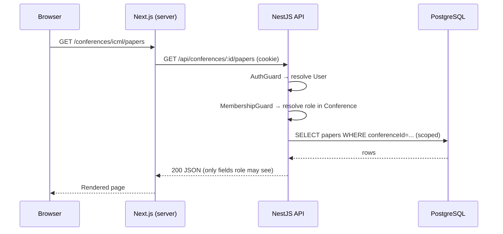
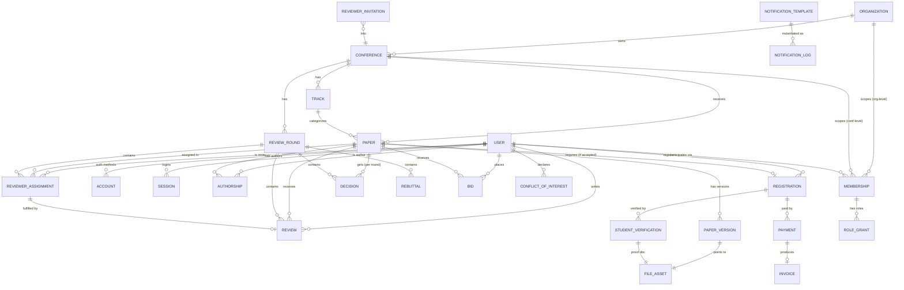
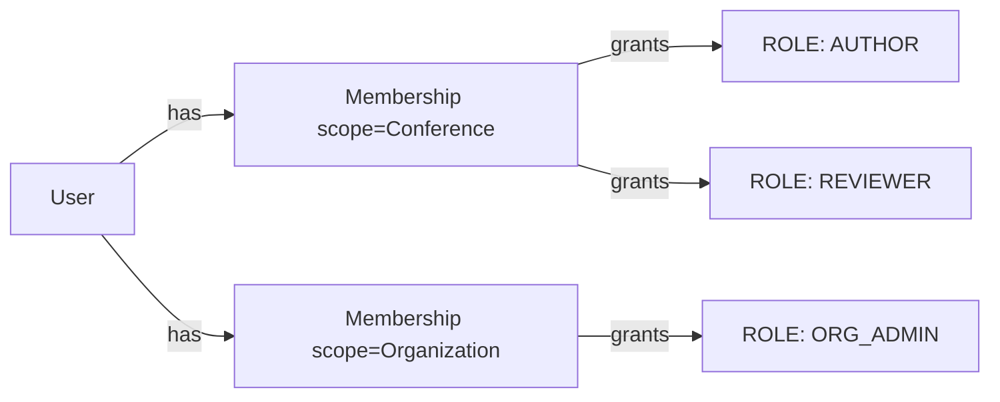
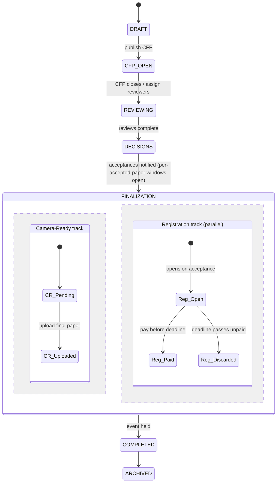
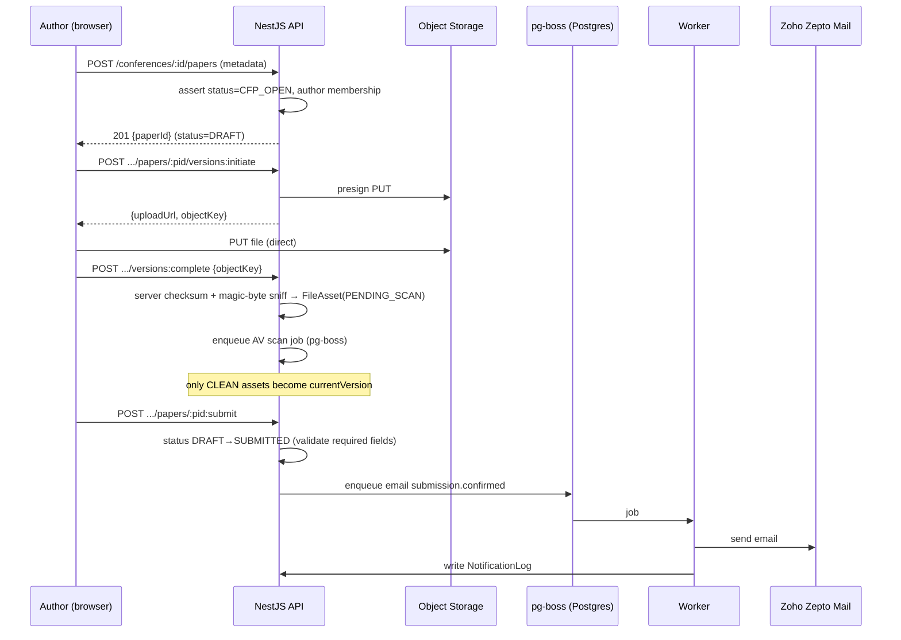
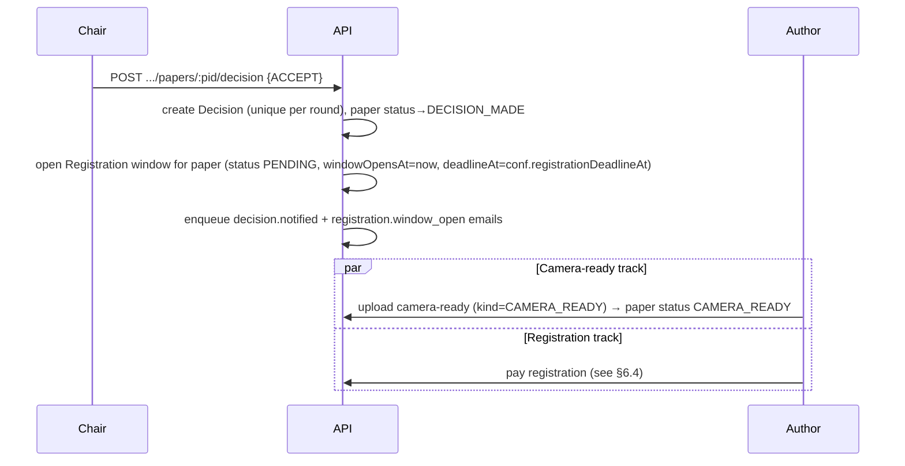
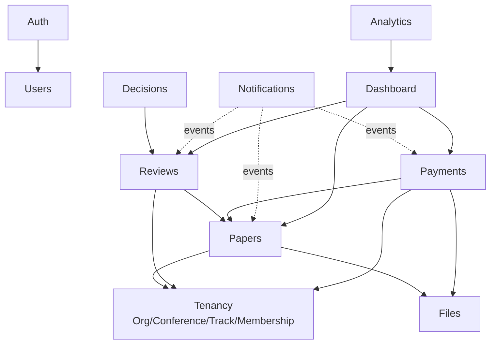
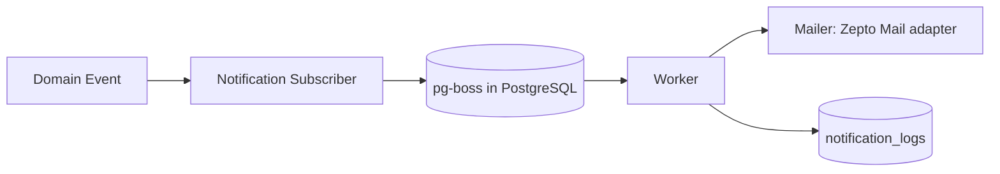
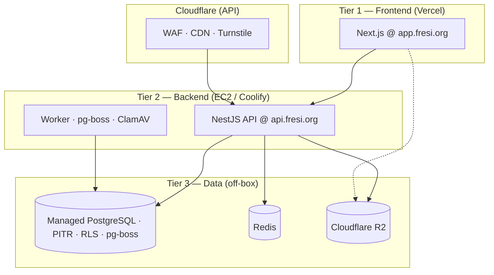
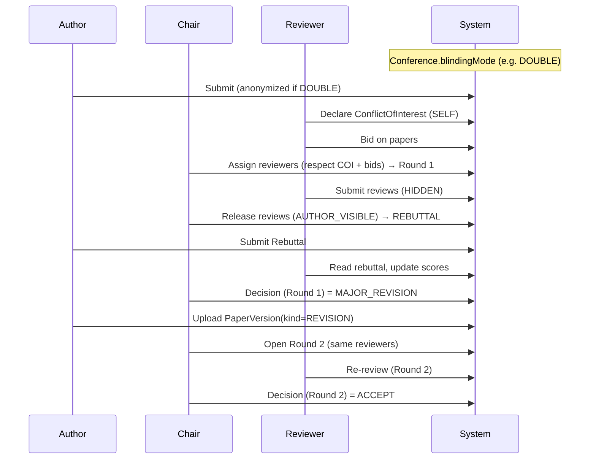

# OpenConferences — System Design Document

> Production-grade architecture for a multi-conference management platform.
> Status: **Draft v2** — domain model first; reconciled after formal architecture review (§18). Implementation details remain deliberately deferred until the model is validated.

---

## Table of Contents

1. [Vision](#1-vision)
2. [High-Level Architecture](#2-high-level-architecture)
3. [Core Domain Model](#3-core-domain-model)
4. [Database Design](#4-database-design)
5. [Authentication & Authorization](#5-authentication--authorization)
6. [Conference Lifecycle](#6-conference-lifecycle)
7. [Module Design](#7-module-design)
8. [API Design](#8-api-design)
9. [File Storage](#9-file-storage)
10. [Payment System](#10-payment-system)
11. [Email System](#11-email-system)
12. [Dashboard Design](#12-dashboard-design)
13. [Scalability](#13-scalability)
14. [Future SaaS Migration](#14-future-saas-migration)
15. [Key Decision: Global vs. Per-Conference Users](#key-decision-global-identity-vs-per-conference-users)
16. [Technology Stack & Tooling Decisions](#16-technology-stack--tooling-decisions)
17. [Deployment & Hosting](#17-deployment--hosting)
18. [Architecture Revisions — ARB Remediation](#18-architecture-revisions--arb-remediation)
19. [Peer Review Model](#19-peer-review-model)
20. [Revised Operating Cost](#20-revised-operating-cost)

> **Document version:** v2 — reconciled after formal architecture review (§18). Earlier single-box / no-Redis assumptions have been removed throughout; §§18–20 remain the detailed rationale and cost model.

## 1. Vision

### 1.1 The long-term product

OpenConferences is being built as the **internal operating system for an academic conference business**. The company will run conferences across many disciplines (AI, CS, Mechanical, Civil, Electrical, Management, Medical, …), each with its own program committee, tracks, deadlines, and fee structure, but all sharing the same underlying workflows: collect submissions, recruit reviewers, run peer review, render decisions, collect camera-ready papers, take registration payments, and communicate with everyone by email.

The strategic insight is that **the conference, not the company, is the natural unit of work** — and a serious organizer runs _many_ conferences over time. So the platform is modeled around a hierarchy from day one:

```
Organization → Conference → Track → Paper → Review → Decision
```

Today there is exactly one Organization (yours). The schema, the APIs, and the authorization model are nonetheless written as if there could be thousands. This costs almost nothing now and removes the single most expensive refactor later.

### 1.2 Three horizons

| Horizon                             | Who uses it                                              | What ships                                                                             |
| ----------------------------------- | -------------------------------------------------------- | -------------------------------------------------------------------------------------- |
| **H1 — Internal platform (now)**    | Your staff + the authors/reviewers of _your_ conferences | Full conference lifecycle, single Organization, all features in the MVP scope          |
| **H2 — Multi-organization (later)** | A handful of trusted partner organizers                  | Organization self-service, per-org branding, isolated data, role delegation            |
| **H3 — Public SaaS**                | Anyone                                                   | Self-signup orgs, custom domains, white-label, subscription/usage billing, marketplace |

The architecture must make **H1 → H2** essentially a feature-flag and onboarding exercise, and **H2 → H3** a billing + provisioning exercise — _not_ a data-model rewrite.

### 1.3 Why this architecture supports SaaS expansion

Four decisions do the heavy lifting:

1. **`organizationId` exists on every tenant-scoped row from day one.** Multi-tenancy is the hardest thing to retrofit; we pay for it upfront while the cost is one column and one index.
2. **Global user identity + conference-scoped roles.** A person is one `User`; their powers are granted per `Conference` via membership. This is exactly the model SaaS needs and it is _also_ the best model for internal use (see §15).
3. **Modular monolith with DDD boundaries.** Each domain (Conferences, Papers, Reviews, Payments, …) is a self-contained NestJS module with its own service layer and clear public interface. If one module ever must scale independently, it can be extracted with surgical, not structural, effort.
4. **Provider-abstracted side effects.** Payments, email, and storage sit behind interfaces (`PaymentProvider`, `Mailer`, `FileStore`). Razorpay today, Stripe tomorrow, Zoho Zepto Mail today — swapping is a config + adapter change, never a domain change.

### 1.4 Non-goals (explicitly out of scope for MVP)

AI matching/summarization, sponsor management, QR check-in, mobile apps, proceedings/PDF generation, white-label theming. Each is intentionally deferred and the architecture leaves clean seams for them, but **building them now would trade validation speed for speculative flexibility** — the wrong trade at H1.

## 2. High-Level Architecture

### 2.1 Topology

A single deployable **modular monolith** (NestJS) serves a REST API. A **Next.js** app renders the UI. **Managed PostgreSQL** (with PITR) is the system of record; **pg-boss** runs the job queue in a dedicated schema on that database. A small **Redis** handles session cache, app cache, and rate limiting. **Cloudflare** sits in front of the API (WAF, edge rate limits, Turnstile, CDN). **Cloudflare R2** holds files. Razorpay and Zoho Zepto Mail are external providers. The frontend is hosted on **Vercel** (`app.fresi.org`); `api` and `worker` run in Docker via Coolify on **Amazon EC2** (`api.fresi.org`); the database is off-box.

```mermaid
graph TD
  subgraph Client
    B[Browser]
  end

  subgraph Edge["Cloudflare"]
    CF[WAF · rate limit · Turnstile · CDN]
  end

  subgraph Frontend["Vercel — app.fresi.org"]
    FE[Next.js<br/>SSR + Server Actions]
  end

  subgraph App["EC2 via Coolify — api.fresi.org"]
    API[NestJS Modular Monolith<br/>REST API]
    WK[Background Worker<br/>pg-boss consumers]
  end

  subgraph Data
    PG[(Managed PostgreSQL<br/>data + pg-boss queue + RLS)]
    RD[(Redis<br/>sessions · cache · rate limit)]
  end

  subgraph External
    R2[(Cloudflare R2)]
    RZ[Razorpay]
    ZM[Zoho Zepto Mail]
  end

  B -->|HTTPS| FE
  B -->|HTTPS| CF
  CF --> API
  FE -->|REST + auth cookie| API
  API --> PG
  API --> RD
  API -->|presigned URLs| R2
  B -.->|direct upload/download via presigned URL| R2
  API -->|create order / verify| RZ
  RZ -.->|webhook raw body| API
  WK --> PG
  WK --> RD
  WK --> ZM
  WK --> R2
  API -->|enqueue jobs (pg-boss)| PG
  PG -->|jobs| WK
```

### 2.2 Component responsibilities

| Component                      | Responsibility                                                           | Notes                                                                                                                                 |
| ------------------------------ | ------------------------------------------------------------------------ | ------------------------------------------------------------------------------------------------------------------------------------- |
| **Next.js frontend**           | All UI; SSR for authenticated dashboards; talks only to the NestJS API   | Hosted on **Vercel** at `app.fresi.org`. TypeScript, Tailwind, shadcn/ui. No business logic beyond presentation/validation.           |
| **NestJS API**                 | All domain logic, authorization, transactions, provider orchestration    | Hosted on **EC2/Coolify** at `api.fresi.org`. The only writer to PostgreSQL. Single source of truth for rules.                        |
| **Background worker**          | Email, reminders, webhook reconciliation, AV scan jobs, exports          | Same codebase, `--worker` entrypoint. Consumes `pg-boss` jobs; graceful drain on SIGTERM.                                             |
| **PostgreSQL (managed, PITR)** | System of record + job queue (`pg-boss` schema) + **Row-Level Security** | Off-box; point-in-time recovery. RLS keyed on `organizationId`/`conferenceId` as defense-in-depth.                                    |
| **Redis**                      | Session cache, app cache, **rate limiting**                              | Small instance (Upstash or container). Not the job queue — pg-boss owns async work.                                                   |
| **Cloudflare**                 | WAF, edge rate limits, Turnstile (bot/CAPTCHA), CDN                      | In front of all public traffic; complements Redis app-level limits.                                                                   |
| **Cloudflare R2**              | Paper PDFs, camera-ready files, supplementary material, invoices         | S3-compatible; **zero egress fees** (key for PDF/proceedings downloads). Private buckets; access only via short-lived presigned URLs. |
| **Razorpay**                   | Registration payments                                                    | Order creation server-side, signature verification, webhook for truth.                                                                |
| **Zoho Zepto Mail**            | Transactional email                                                      | Behind a `Mailer` interface; all sends go through the worker. SMTP/API adapter; strong deliverability and low cost at scale.          |

### 2.3 Request/response flow (typical authenticated read)



### 2.4 Why this shape

- **One API surface, one auth model.** The Next.js layer never touches the database directly; this keeps authorization in exactly one place and makes a future mobile/3rd-party client trivial.
- **Worker is not a separate service, just a separate process.** Same code, same models — no distributed-systems tax, but emails and reminders never block a web request and survive restarts.
- **Direct-to-S3 transfers.** Large PDFs never stream through the API; the API only mints presigned URLs. This keeps the monolith small and cheap.
- **Defense in depth at the edge.** Cloudflare (WAF, rate limits, Turnstile) plus Redis (session cache, app limits) protect auth and payment paths without adding service topology.

## 3. Core Domain Model

This is the heart of the document. We design the model first; tables and APIs follow from it.

### 3.1 Bounded contexts (DDD-inspired)

We group entities into contexts that map 1:1 to backend modules. Boundaries are drawn where transactions and invariants cluster.

| Context        | Owns                                                                                                                     | Core invariant it protects                                                                                                                    |
| -------------- | ------------------------------------------------------------------------------------------------------------------------ | --------------------------------------------------------------------------------------------------------------------------------------------- |
| **Identity**   | `User`, `Account`, `Session`                                                                                             | One human = one global identity                                                                                                               |
| **Tenancy**    | `Organization`, `Conference`, `Track`, `Membership`                                                                      | Every conference belongs to exactly one org; every actor's power is scoped to a conference                                                    |
| **Submission** | `Paper`, `Authorship`, `PaperVersion`, `FileAsset`                                                                       | A paper always belongs to one track; authorship order is stable; the "current" version is unambiguous                                         |
| **Review**     | `ReviewRound`, `ReviewerInvitation`, `Bid`, `ConflictOfInterest`, `ReviewerAssignment`, `Review`, `Rebuttal`, `Decision` | A reviewer cannot review their own paper or a declared conflict; one decision per paper per round; identity visibility follows `blindingMode` |
| **Billing**    | `Registration`, `Payment`, `Invoice`                                                                                     | Money state transitions are append-only and idempotent                                                                                        |
| **Messaging**  | `NotificationTemplate`, `NotificationLog`                                                                                | Every outbound email is recorded; templates are data, not code                                                                                |

### 3.2 Entity-relationship diagram



### 3.3 Entity catalogue and relationships

**Organization** — the tenant root. Today there is one. Holds branding, billing settings, default conference policies. _Everything tenant-scoped carries `organizationId`._

**Conference** — a single event/edition (e.g., "ICML 2026"). Belongs to one Organization. Owns its own **dated phase windows** (CFP, bidding, review, rebuttal, decision, camera-ready, registration), fee schedule, review configuration, **`blindingMode`** (`SINGLE` / `DOUBLE` / `OPEN`), and CFP. A conference is the primary authorization scope. `Conference.status` is a **derived/display label** — the real workflow drivers are per-phase deadlines and per-paper state (§6, §19).

**Track** — a sub-area within a conference (e.g., "Main", "Workshop on X", "Industry"). Every paper belongs to exactly one track. Tracks let one conference run parallel review processes. Even single-track conferences get one default "Main" track so the model is uniform.

**User** — a global human identity. Exactly one account per person across all conferences and all roles. A user is _not_ an author or reviewer intrinsically; those are roles they hold within specific conferences. (Deep justification in §15.)

**Account / Session** — Better Auth's identity primitives. `Account` stores credential/OAuth links; `Session` stores active logins. One `User` ↔ many `Account`/`Session`.

**Membership** — the join between `User` and a scope (`Conference`, or `Organization` for org-level admins). _This is the linchpin of the whole authorization model._ A membership carries one or more `RoleGrant`s. "Alice is a Reviewer **and** an Author in ICML 2026, and an Organizer in NeurIPS 2026" = three memberships, four role grants.

**RoleGrant** — a single role (`AUTHOR`, `REVIEWER`, `ORGANIZER`, `CHAIR`, …) attached to a membership. Modeled as rows (not a single enum column) so a user can hold multiple roles in the same conference simultaneously.

**Paper** — a submission within a conference+track. Holds metadata (title, abstract, keywords, status) but _not_ the file bytes. Lifecycle status is **per-paper** (`DRAFT → SUBMITTED → UNDER_REVIEW → DECISION_MADE → [REVISION if needed] → CAMERA_READY → WITHDRAWN / WITHDRAWN_NONPAYMENT`). Carries `version int` for optimistic locking.

**Authorship** — join between `User` and `Paper` carrying `order` (author position) and `isCorresponding`. Authors are users; this preserves single-identity and lets an author see all their papers across conferences in one dashboard. (External co-authors who never log in are handled as lightweight "author records" — see §4.)

**PaperVersion** — an immutable revision of a paper's file (submission v1, v2, camera-ready). Points to a `FileAsset`. The paper references its `currentVersionId`. Versioning is append-only; nothing is overwritten.

**FileAsset** — a stored object (S3 key, size, server-computed checksum, sniffed mime, uploadedBy). Lifecycle: `PENDING_SCAN → CLEAN | INFECTED`. Only `CLEAN` assets may become a `currentVersion` or be downloaded. Decouples storage from purpose so invoices, supplementary files, and papers reuse one abstraction.

**ReviewRound** — first-class owner of a review cycle within a conference (`roundNumber`, `status`, review/rebuttal/revision due dates). Assignments, reviews, rebuttals, and decisions belong to a round. A `MINOR_REVISION` / `MAJOR_REVISION` decision opens the next round and expects a new `PaperVersion(kind=REVISION)`.

**Bid** — a reviewer's expressed interest in reviewing a paper (`EAGER` / `YES` / `MAYBE` / `NO` / `CONFLICT`), collected in a bidding window before assignment.

**ConflictOfInterest** — an explicit, declared conflict between a user and a paper or another user (`CO_AUTHOR`, `INSTITUTION`, `ADVISOR_STUDENT`, `PERSONAL`, …), declared by self, chair, or system. Assignment rejects both authorship (inferred) and declared COIs.

**Rebuttal** — the corresponding author's structured response to released reviews, one per paper per round, submitted before the final decision in that round.

**ReviewerInvitation** — an invitation for a person to become a reviewer of a conference, possibly before they have an account. Tracks token, email, status (`PENDING/ACCEPTED/DECLINED/EXPIRED`). On acceptance it materializes a `Membership` with a `REVIEWER` role.

**ReviewerAssignment** — links a reviewer to a specific `Paper` within a `ReviewRound`. Carries assignment status and due date. Creation rejects authorship and declared `ConflictOfInterest` rows.

**Review** — the reviewer's evaluation: scores, recommendation, confidence, comments to authors, confidential comments to chairs. One review per assignment. Carries `visibility` (`HIDDEN` → `AUTHOR_VISIBLE` when chair releases for rebuttal). Identity fields shown to the reviewer follow `Conference.blindingMode`.

**Decision** — the editorial outcome for a paper in a `ReviewRound`: `ACCEPT / REJECT / MINOR_REVISION / MAJOR_REVISION`. One decision per paper per round. Revision outcomes open the next `ReviewRound`.

**Registration** — an accepted paper's registration obligation. Opens on acceptance notification; runs **in parallel** with camera-ready. Records **audience** (`REGULAR`/`STUDENT`), **locked timing** (`EARLY`/`REGULAR`, fixed at **payment capture**), `amountDueMinor`, and status. If `audience=STUDENT`, payment is blocked until a supporting document is uploaded. **Per paper** — an author with two accepted papers has two registrations. Payable/visible by any claimed author on the paper; `userId` records who paid. Carries `version int` for optimistic locking. Non-payment by deadline → `WITHDRAWN_NONPAYMENT`.

**StudentVerification** — manual review of a student-tier registration. Author **must** upload proof **before** payment. Organizer sets `APPROVED`, `REJECTED`, or `CLARIFICATION_REQUESTED`. Rejection bumps `amountDueMinor` to `REGULAR @ lockedTiming` and triggers an additional payment.

**Payment** — append-only record against a registration (`CREATED → AUTHORIZED → CAPTURED / FAILED / REFUNDED`). Multiple captures allowed (initial + additional). Registration is `PAID` when **(Σ captured − Σ refunded) ≥ amountDueMinor**, computed in a single `FOR UPDATE` transaction.

**Invoice** — a generated financial document for a captured payment; stored as a `FileAsset`.

**NotificationTemplate** — a named, versioned email template (subject + body with variables). Data, not code, so organizers can edit copy without a deploy.

**NotificationLog** — a record of every email queued/sent (recipient, template, status, provider id). Enables resend, audit, and "did the reviewer get the reminder?" support.

### 3.4 Relationship rules that matter

- **Scope chain:** `Organization 1—* Conference 1—* Track 1—* Paper`. A paper's organization is always derivable; we still denormalize `organizationId` and `conferenceId` onto `Paper` for query and authorization speed (see §4).
- **People are global, roles are local:** `User *—* Conference` through `Membership`; powers come from `RoleGrant` rows, never from a column on `User`.
- **Authorship vs. account:** the _submitting_ author must be a `User`. Co-authors may exist as data without accounts and can be "claimed" later by linking to a `User`.
- **Reviews hang off assignments in a round:** you cannot write a `Review` without a `ReviewerAssignment` in a `ReviewRound`; COI is enforced structurally (authorship + declared `ConflictOfInterest`).
- **Money is append-only:** `Registration 1—* Payment`; paid state = `(Σ captured − Σ refunded) ≥ amountDueMinor`, computed in one transaction with optimistic locking on `Registration`.
- **Registration is per accepted paper:** `Paper 1—1 Registration`; window opens on acceptance; runs concurrently with camera-ready.
- **Discounts = one fee-matrix cell:** audience × timing; timing locked at **capture**; audience provisional until student verification completes.
- **Student document is a hard gate before payment:** `initiatePayment` rejected until `StudentVerification.fileAssetId` exists.
- **Child resources must match path scope:** every load by `:paperId`/`:assignmentId`/etc. asserts `entity.conferenceId === route.conferenceId` (IDOR prevention); Postgres RLS is the backstop.
- **Identity visibility follows `blindingMode`:** authorization decides whether a reviewer may see author identity — not a hard-coded strip.

## 4. Database Design

PostgreSQL, accessed via Prisma. Conventions used throughout:

- **Primary keys:** `id` as **UUIDv7 or ULID** generated in the application (time-sortable). Do **not** use Postgres `@default(uuid())` — that emits random v4 and hurts B-tree locality at scale.
- **Timestamps:** `createdAt`, `updatedAt` (UTC `timestamptz`) on every table.
- **Optimistic locking:** `version int` on `papers`, `registrations`, `decisions` (and other high-contention mutable rows).
- **Soft delete:** `deletedAt timestamptz NULL` on user-facing entities; **partial unique indexes** `WHERE deleted_at IS NULL` on `users.email`, `conferences(organizationId, slug)`, `reviewer_invitations(conferenceId, email)`, etc.
- **Tenant column:** `organizationId` on every tenant-scoped table, indexed. **Row-Level Security** enabled in H1 keyed on `organizationId`/`conferenceId`.
- **Enums:** Postgres native enums for closed sets; lookup tables only when values are user-editable.
- **Money:** stored as integer minor units (`amountMinor int`) + `currency char(3)`. Never floats.

### 4.1 Enums

```sql
CREATE TYPE conference_status   AS ENUM ('DRAFT','CFP_OPEN','REVIEWING','DECISIONS','FINALIZATION','COMPLETED','ARCHIVED');
CREATE TYPE role_kind           AS ENUM ('PLATFORM_ADMIN','ORG_ADMIN','ORGANIZER','CHAIR','REVIEWER','AUTHOR');
CREATE TYPE membership_scope    AS ENUM ('ORGANIZATION','CONFERENCE');
CREATE TYPE paper_status        AS ENUM ('DRAFT','SUBMITTED','UNDER_REVIEW','DECISION_MADE','CAMERA_READY','WITHDRAWN','WITHDRAWN_NONPAYMENT');
CREATE TYPE version_kind        AS ENUM ('SUBMISSION','REVISION','CAMERA_READY','SUPPLEMENTARY');
CREATE TYPE invitation_status   AS ENUM ('PENDING','ACCEPTED','DECLINED','EXPIRED');
CREATE TYPE assignment_status   AS ENUM ('ASSIGNED','ACCEPTED','DECLINED','COMPLETED','REVOKED');
CREATE TYPE recommendation      AS ENUM ('STRONG_ACCEPT','ACCEPT','WEAK_ACCEPT','BORDERLINE','WEAK_REJECT','REJECT','STRONG_REJECT');
CREATE TYPE decision_outcome    AS ENUM ('ACCEPT','REJECT','MINOR_REVISION','MAJOR_REVISION');
CREATE TYPE payment_status      AS ENUM ('CREATED','AUTHORIZED','CAPTURED','FAILED','REFUNDED','PARTIALLY_REFUNDED');
CREATE TYPE fee_audience        AS ENUM ('REGULAR','STUDENT');
CREATE TYPE fee_timing          AS ENUM ('EARLY','REGULAR');
CREATE TYPE registration_status AS ENUM ('PENDING','AWAITING_VERIFICATION','ADDITIONAL_PAYMENT_REQUIRED','PAID','CANCELLED','REFUNDED','DISCARDED_NONPAYMENT');
CREATE TYPE verification_status AS ENUM ('PENDING','APPROVED','REJECTED','CLARIFICATION_REQUESTED');
CREATE TYPE notification_status AS ENUM ('QUEUED','SENT','FAILED','BOUNCED');
CREATE TYPE blinding_mode       AS ENUM ('SINGLE','DOUBLE','OPEN');
CREATE TYPE bid_value           AS ENUM ('EAGER','YES','MAYBE','NO','CONFLICT');
CREATE TYPE coi_type            AS ENUM ('CO_AUTHOR','INSTITUTION','ADVISOR_STUDENT','PERSONAL','FINANCIAL','OTHER');
CREATE TYPE coi_source          AS ENUM ('SELF','CHAIR','SYSTEM');
CREATE TYPE round_status        AS ENUM ('OPEN','REVIEWING','REBUTTAL','DECIDING','CLOSED');
CREATE TYPE review_visibility   AS ENUM ('HIDDEN','AUTHOR_VISIBLE','PUBLIC');
CREATE TYPE file_scan_status    AS ENUM ('PENDING_SCAN','CLEAN','INFECTED');
```

Peer-review table details: §19.

### 4.2 Table-by-table

Below, each table lists **purpose / PK / FKs / indexes / constraints**. Representative Prisma models follow.

#### `organizations`

- **Purpose:** tenant root.
- **PK:** `id`.
- **FKs:** none.
- **Indexes:** unique `slug`.
- **Constraints:** `slug` matches `^[a-z0-9-]+$`.

#### `users`

- **Purpose:** global human identity (managed alongside Better Auth).
- **PK:** `id`.
- **Indexes:** unique `email WHERE deleted_at IS NULL` (citext); index on `name`.
- **Constraints:** `email` not null, unique. No `role` column — roles live in `role_grants`.

#### `accounts`, `sessions`, `verification_tokens`

- **Purpose:** Better Auth credential/OAuth links and active sessions.
- **PK:** `id`. **FK:** `userId → users.id` (cascade delete).
- **Indexes:** `(userId)`, unique `(provider, providerAccountId)`, `sessions.token` unique.

#### `conferences`

- **Purpose:** a single conference edition.
- **PK:** `id`. **FK:** `organizationId → organizations.id`.
- **Indexes:** unique `(organizationId, slug) WHERE deleted_at IS NULL`; index `(organizationId, status)`.
- **Constraints:** `cfpOpensAt < cfpClosesAt`; `status` non-null. Columns: `blindingMode blinding_mode`, JSONB `reviewConfig`, JSONB `feeSchedule`, plus dated phase windows (`cfpOpensAt`, `cfpClosesAt`, `biddingOpensAt`, `biddingClosesAt`, `reviewDueAt`, `rebuttalDueAt`, …).

#### `tracks`

- **Purpose:** review sub-stream within a conference.
- **PK:** `id`. **FKs:** `conferenceId`, `organizationId`.
- **Indexes:** unique `(conferenceId, slug)`.

#### `memberships`

- **Purpose:** a user's participation in a scope (org or conference).
- **PK:** `id`. **FKs:** `userId`, `organizationId`, nullable `conferenceId`.
- **Indexes:** unique `(userId, scope, organizationId, conferenceId)`; index `(conferenceId)`, `(userId)`.
- **Constraints:** `scope='CONFERENCE'` ⇒ `conferenceId NOT NULL`; `scope='ORGANIZATION'` ⇒ `conferenceId NULL` (CHECK).

#### `role_grants`

- **Purpose:** one role on one membership (enables multi-role).
- **PK:** `id`. **FK:** `membershipId → memberships.id` (cascade).
- **Indexes:** unique `(membershipId, role)`.

#### `papers`

- **Purpose:** submission metadata (not bytes).
- **PK:** `id`. **FKs:** `conferenceId`, `trackId`, `organizationId`, nullable `currentVersionId`, `submittedById → users.id`.
- **Indexes:** `(conferenceId, status)`, `(trackId)`, `(submittedById)`, GIN on `keywords`.
- **Constraints:** `title` not empty; `status` non-null; `version int` for optimistic locking.

#### `file_assets`

- **Purpose:** one stored object with AV gating.
- **PK:** `id`. **FKs:** `organizationId`, `uploadedById`.
- **Columns:** `bucket`, `objectKey` (unique), `sizeBytes bigint`, `checksumSha256` (server-computed), `mimeType` (magic-byte sniffed), `originalFilename`, `scanStatus file_scan_status` (default `PENDING_SCAN`).

#### `review_rounds`, `bids`, `conflicts_of_interest`, `rebuttals`

- See §19 for full schemas. Integrated here: assignments/reviews/decisions FK `roundId → review_rounds.id` (replacing loose `round int`).

#### `reviewer_invitations`

- **Purpose:** invite a (possibly account-less) person to review a conference.
- **PK:** `id`. **FKs:** `conferenceId`, `organizationId`, nullable `invitedUserId`.
- **Columns:** `email` (citext), `token` (unique), `status invitation_status`, `expiresAt`.
- **Indexes:** unique `(conferenceId, email) WHERE deleted_at IS NULL` (if soft-deleted).

#### `authorships`

- **Purpose:** ordered author list for a paper; links to a `User` when claimed.
- **PK:** `id`. **FKs:** `paperId` (cascade), nullable `userId`.
- **Columns:** `order int`, `isCorresponding bool`, plus snapshot `fullName`, `email`, `affiliation` (so external co-authors need no account).
- **Indexes:** unique `(paperId, order)`; index `(userId)`, `(email)`.
- **Constraints:** exactly one `isCorresponding=true` per paper (partial unique index); reorder via deferred constraint or offset technique (§18.10).

#### `paper_versions`

- **Purpose:** immutable file revisions.
- **PK:** `id`. **FKs:** `paperId` (cascade), `fileAssetId`, `uploadedById`.
- **Columns:** `kind version_kind`, `versionNumber int`, `note text`.
- **Indexes:** unique `(paperId, kind, versionNumber)`.

#### `reviewer_assignments`

- **Purpose:** assign a reviewer to a paper within a review round.
- **PK:** `id`. **FKs:** `paperId`, `roundId → review_rounds.id`, `reviewerUserId`, `conferenceId`, `assignedById`.
- **Columns:** `status assignment_status`, `dueAt`.
- **Indexes:** unique `(paperId, reviewerUserId, roundId)`; index `(reviewerUserId, status)`.
- **Constraints:** rejects authorship (inferred) and declared `conflicts_of_interest` (§5, §19).

#### `reviews`

- **Purpose:** the evaluation tied to an assignment.
- **PK:** `id`. **FK:** `assignmentId` (unique, 1:1), `roundId`, `paperId` (denorm), `reviewerUserId` (denorm).
- **Columns:** `scores jsonb`, `recommendation`, `confidence`, `commentsToAuthors`, `commentsToChairs`, `visibility review_visibility` (default `HIDDEN`), `submittedAt`.
- **Indexes:** unique `(assignmentId)`; index `(paperId)`.

#### `decisions`

- **Purpose:** outcome per paper per round.
- **PK:** `id`. **FKs:** `paperId`, `roundId`, `decidedById`, `conferenceId`.
- **Columns:** `outcome decision_outcome`, `rationale`, `notifiedAt`, `version int`.
- **Indexes:** unique `(paperId, roundId)`.

#### `registrations`

- **Purpose:** the registration obligation for one accepted paper (opens on acceptance, runs parallel to camera-ready).
- **PK:** `id`. **FKs:** `paperId`, `userId` (who paid), `conferenceId`, `organizationId`.
- **Columns:**
  - `audience fee_audience`,
  - `lockedTiming fee_timing NULL` (set at **payment capture**; `NULL` until then),
  - `amountDueMinor int`,
  - `currency char(3)`,
  - `status registration_status`,
  - `version int`,
  - `windowOpensAt`, `deadlineAt`.
- **Indexes:** unique `(conferenceId, paperId)`; index `(userId)`, `(conferenceId, status)`, partial index on `(deadlineAt)` for unpaid rows.
- **Constraints:** `PAID` ⇔ `(Σ captured − Σ refunded) ≥ amountDueMinor` in a `FOR UPDATE` transaction. `initiatePayment` blocked for `STUDENT` without document. Any claimed author may pay; `userId` records payer.

#### `student_verifications`

- **Purpose:** manual review of a student-tier registration's supporting document; supports clarification/resubmission cycles.
- **PK:** `id`. **FKs:** `registrationId` (cascade), `fileAssetId` (uploaded proof), `organizationId`, nullable `reviewedById → users.id`.
- **Columns:** `status verification_status` (default `PENDING`), `note text` (clarification/rejection reason), `submittedAt`, `reviewedAt`.
- **Indexes:** `(registrationId)`, `(status)`, partial index on `(organizationId) WHERE status='PENDING'` (verification queue). The latest row per `registrationId` is authoritative.

#### `payments`

- **Purpose:** append-only payment records against a registration (initial fee and any later additional payment).
- **PK:** `id`. **FKs:** `registrationId`, `organizationId`.
- **Columns:** `provider text`, `providerOrderId`, `providerPaymentId`, `status payment_status`, `amountMinor`, `currency`, `kind text` (`INITIAL`/`ADDITIONAL`), `rawPayload jsonb`.
- **Indexes:** unique `(provider, providerPaymentId)`; index `(registrationId)`.

#### `invoices`

- **Purpose:** financial doc for a captured payment.
- **PK:** `id`. **FKs:** `paymentId` (unique), `fileAssetId`, `organizationId`.
- **Columns:** `number text` from a Postgres **`SEQUENCE` per org/fiscal scope** (never `MAX()+1`), `issuedAt`.

#### `notification_templates`

- **Purpose:** editable, versioned email templates.
- **PK:** `id`. **FK:** `organizationId` (nullable ⇒ platform default).
- **Columns:** `key text` (e.g. `submission.confirmed`), `version int`, `subject`, `bodyMjml/bodyHtml`, `variables jsonb`.
- **Indexes:** unique `(organizationId, key, version)`.

#### `notification_logs`

- **Purpose:** record of every send.
- **PK:** `id`. **FKs:** `templateId`, `organizationId`, nullable `userId`, nullable `conferenceId`.
- **Columns:** `toEmail`, `status notification_status`, `providerMessageId`, `error text`, `sentAt`.
- **Indexes:** `(conferenceId)`, `(toEmail)`, `(status)`.

#### `audit_logs` (cross-cutting)

- **Purpose:** append-only, tamper-evident record of sensitive actions (decisions, role grants, refunds, verification outcomes).
- **Columns:** `actorUserId`, `organizationId`, `conferenceId`, `action`, `entity`, `entityId`, `diff jsonb`, `createdAt`.
- **Constraints:** DB revokes UPDATE/DELETE on this table. Role grants enforce privilege ceiling (granter cannot grant role ≥ own max).

### 4.3 Representative Prisma schema (excerpt)

> **Note:** generate UUIDv7/ULID in the application layer (`@default(dbgenerated(...))` or pre-insert hook) — do not rely on `@default(uuid())` (v4). Add `version Int @default(0)` on mutable aggregates.

```prisma
model User {
  id          String       @id @db.Uuid  // UUIDv7 from app
  email       String       @unique
  name        String?
  memberships Membership[]
  authorships Authorship[]
  createdAt   DateTime     @default(now())
  updatedAt   DateTime     @updatedAt
  deletedAt   DateTime?
}

model Conference {
  id             String           @id @default(uuid()) @db.Uuid
  organizationId String           @db.Uuid
  organization   Organization     @relation(fields: [organizationId], references: [id])
  slug           String
  name           String
  status         ConferenceStatus @default(DRAFT)
  cfpOpensAt     DateTime?
  cfpClosesAt    DateTime?
  reviewConfig   Json
  feeSchedule    Json
  tracks         Track[]
  papers         Paper[]
  memberships    Membership[]
  createdAt      DateTime         @default(now())
  updatedAt      DateTime         @updatedAt
  deletedAt      DateTime?

  @@unique([organizationId, slug])
  @@index([organizationId, status])
}

model Membership {
  id             String          @id @default(uuid()) @db.Uuid
  userId         String          @db.Uuid
  organizationId String          @db.Uuid
  conferenceId   String?         @db.Uuid
  scope          MembershipScope
  user           User            @relation(fields: [userId], references: [id])
  conference     Conference?     @relation(fields: [conferenceId], references: [id])
  roles          RoleGrant[]
  createdAt      DateTime        @default(now())

  @@unique([userId, scope, organizationId, conferenceId])
  @@index([conferenceId])
  @@index([userId])
}

model RoleGrant {
  id           String     @id @default(uuid()) @db.Uuid
  membershipId String     @db.Uuid
  membership   Membership @relation(fields: [membershipId], references: [id], onDelete: Cascade)
  role         RoleKind
  @@unique([membershipId, role])
}
```

### 4.4 Normalization decisions (and the deliberate denormalizations)

- **3NF baseline.** Roles, authorships, versions, payments are all separated into their own tables rather than crammed into JSON or repeated columns. This keeps invariants enforceable with constraints and unique indexes.
- **Roles as rows, not a column.** A `role` enum on `users` (or even on `memberships`) cannot represent "Author _and_ Reviewer in the same conference". `role_grants` solves this cleanly and is the single most important normalization choice for the auth model.
- **Author snapshots are intentional duplication.** `authorships` stores `fullName/email/affiliation` even when `userId` is set. Author metadata at submission time is a historical fact and must not change when a user later edits their profile. This is denormalization for _correctness_, not performance.
- **JSONB for genuinely flexible config** (`reviewConfig`, `feeSchedule`, review `scores`) — configuration only, never relational keys.
- **Denormalized `organizationId`/`conferenceId` on deep tables** (papers, reviews, payments). Present for query speed, authorization, and **Postgres RLS policies** (enabled in H1).
- **Append-only money + audit.** `payments` and `audit_logs` are never updated; `audit_logs` has UPDATE/DELETE revoked at the DB level.
- **Partitioning + retention:** `notification_logs` and `audit_logs` are time-partitioned with archival policy (§13, §18.10).

## 5. Authentication & Authorization

### 5.1 Authentication (Better Auth)

- **One global identity.** Better Auth manages `users`, `accounts`, `sessions`. Email+password and/or OAuth.
- **Session strategy.** HTTP-only, secure cookies; sessions stored in Postgres, **cached in Redis** for fast lookup. Next.js forwards the cookie; the API re-validates every request.
- **Email verification** required before submitting papers or accepting reviewer invites. Product UX uses a **same-tab email OTP** (Better Auth `emailOTP` with `overrideDefaultEmailVerification`); magic verification links are not the primary path.
- **Password reset, account recovery, login lockout** enabled via Better Auth.
- **Mandatory MFA** for `ORGANIZER`, `CHAIR`, `ORG_ADMIN`, `PLATFORM_ADMIN` (anyone who moves money or grants roles). Product UX uses **email OTP** (Better Auth two-factor `otpOptions`); authenticator TOTP is not required in the UI.
- **CSRF:** SameSite cookies + CSRF tokens on state-changing routes; strict CORS allow-list.
- **The API never trusts the frontend** for identity.

### 5.2 Authorization model: scoped RBAC

Authorization answers: _"Can this **User** perform this **action** on this **resource** within this **scope**?"_ Scope is an Organization or a Conference. Roles are resolved from `memberships → role_grants`.



**Role hierarchy / capabilities (illustrative):**

| Role             | Scope                        | Can                                                                              |
| ---------------- | ---------------------------- | -------------------------------------------------------------------------------- |
| `PLATFORM_ADMIN` | global                       | everything; manage organizations (H2/H3)                                         |
| `ORG_ADMIN`      | organization                 | create/configure conferences, manage org members, view all org analytics         |
| `ORGANIZER`      | conference                   | configure one conference, assign reviewers, make decisions, manage registrations |
| `CHAIR`          | conference (often per-track) | manage reviews/decisions for their track                                         |
| `REVIEWER`       | conference                   | see assigned papers, submit reviews                                              |
| `AUTHOR`         | conference                   | submit/edit own papers, upload camera-ready, register                            |

Roles are **additive**. A user with both `AUTHOR` and `REVIEWER` in a conference gets the union of permissions — but never sees their _own_ paper in their reviewer queue (COI rule below).

### 5.3 Enforcement mechanics (NestJS)

Three layers, evaluated in order:

1. **`AuthGuard`** — valid session ⇒ resolves `request.user` (Redis cache → Postgres fallback).
2. **`MembershipGuard`** — resolves scope from the route; loads roles. No membership ⇒ `403`.
3. **`@RequireRole(...)` / policy check** — handler guard + **service-level scope assertion**: every child resource loaded by id must match `route.conferenceId`/`organizationId` (IDOR prevention). Cross-tenant existence leaks return **`404`**, not `403`.
4. **`BlindingPolicy`** — identity fields returned to reviewers/authors follow `Conference.blindingMode`.
5. **Privilege ceiling on role grants** — a granter may only grant roles strictly below their own max in the same scope; `PLATFORM_ADMIN` is seed-only. Every grant/revoke → append-only `audit_logs`.

```ts
@UseGuards(AuthGuard, MembershipGuard)
@RequireRole('ORGANIZER', 'CHAIR')
@Post('conferences/:conferenceId/papers/:paperId/decision')
makeDecision(/* ... */) { /* service also re-checks scope + COI */ }
```

**Conflict-of-interest** is structural: `ReviewerAssignment` creation rejects if the reviewer is an author (inferred) **or** has a declared `ConflictOfInterest` row for the paper/user. Reviews only exist via assignments.

### 5.4 Multi-conference, multi-role — worked example

> Dr. Rao is an Author in _ICCV 2026_, a Reviewer in _NeurIPS 2026_, and the Organizer of _MedAI 2026_.

- One `User` row.
- Three `Membership` rows (all `scope=CONFERENCE`), one per conference.
- `RoleGrant`s: `AUTHOR` on the first, `REVIEWER` on the second, `ORGANIZER` on the third.
- A single dashboard aggregates everything (see §12); each API call is authorized against the specific conference scope in the route.

This is impossible to model cleanly with per-conference user accounts and is the central reason for the recommendation in §15.

## 6. Conference Lifecycle

Workflow is driven by **dated phase windows on the conference** (CFP, bidding, review, rebuttal, decision, camera-ready, registration) and **per-paper status** — not by a single global enum alone. `Conference.status` is a derived/display label for organizers. See §19 for the full peer-review cycle (bidding → assignment → review → rebuttal → decision → optional revision rounds).



> **Parallelism note.** Camera-ready and registration are **independent, parallel tracks** within `FINALIZATION`, each gated by its own deadline. They are no longer sequential conference phases. The **registration window is per accepted paper** — it opens the moment that paper's acceptance is notified (which happens during `DECISIONS`/early `FINALIZATION`), not as a global stage. Rejected papers never enter either track.

### 6.1 Submission → confirmation



### 6.2 Bidding → assignment → review → rebuttal → decision

See §19.7 for the full sequence. Summary: reviewers declare COI and bid; chairs assign (respecting bids + COI) into `ReviewRound 1`; reviews submitted (`visibility=HIDDEN`); chair releases reviews (`AUTHOR_VISIBLE`); author submits `Rebuttal`; reviewers may update scores; chair records `Decision`. `MINOR/MAJOR_REVISION` opens `ReviewRound 2` + a new `PaperVersion(kind=REVISION)`.

### 6.3 Decision → acceptance → parallel finalization

On `ACCEPT`, the paper enters `FINALIZATION` and **two independent windows open at once**: camera-ready upload and registration. Neither blocks the other.



### 6.4 Registration & payment (parallel track, per accepted paper)

The author may pay any time between acceptance and the registration deadline. Fee = one cell in the audience × timing matrix. **Timing is locked at payment capture** (webhook), not at order creation; unpaid orders expire quickly. Student registrations require a supporting document **before** payment; verification is asynchronous after payment.

```mermaid
sequenceDiagram
  participant Author
  participant API
  participant RZ as Razorpay
  participant Org as Organizer
  participant Q as pg-boss

  Author->>API: POST .../papers/:pid/registration {audience: STUDENT|REGULAR}
  API->>API: Registration status=PENDING
  alt audience=STUDENT
    Author->>API: upload supporting document → StudentVerification(PENDING)
    Note over API: payment blocked until document on file
  end
  Author->>API: POST .../registration/payment
  API->>API: assert STUDENT ⇒ document exists (else 422); create Razorpay order (short TTL)
  Author->>RZ: pay
  RZ-->>API: webhook payment.captured (raw body verified, idempotent)
  API->>API: lock timing @ capture; Payment→CAPTURED; Registration AWAITING_VERIFICATION or PAID
  opt manual student verification
    Org->>API: approve | clarify | reject
    alt rejected
      API->>API: bump amountDue to REGULAR@lockedTiming; ADDITIONAL_PAYMENT_REQUIRED
      Author->>API: pay difference (capture) → PAID
    end
  end
  note over API: discard sweep: unpaid by deadline → WITHDRAWN_NONPAYMENT
```

## 7. Module Design

The monolith is partitioned into NestJS modules that map to the bounded contexts in §3. Each module owns its entities, exposes a **service interface** for other modules, and keeps its controllers thin. Cross-module calls go through services (never raw repository access into another module's tables) — this is what keeps the monolith _modular_ and extraction-ready.



| Module            | Responsibilities                                                                                                                                   | Key public methods                                                                                                                   | Depends on                |
| ----------------- | -------------------------------------------------------------------------------------------------------------------------------------------------- | ------------------------------------------------------------------------------------------------------------------------------------ | ------------------------- |
| **Auth**          | Session validation, guards, COI helpers                                                                                                            | `getUser(req)`, `requireRole()`                                                                                                      | Better Auth               |
| **Users**         | Profiles, account linking, claim co-author records                                                                                                 | `findById`, `claimAuthorship`                                                                                                        | Auth                      |
| **Tenancy**       | Orgs, conferences, tracks, memberships, role grants, lifecycle transitions                                                                         | `createConference`, `transitionStatus`, `addMember`, `rolesFor(user, scope)`                                                         | Users                     |
| **Papers**        | Submission CRUD, versions, authorships                                                                                                             | `createPaper`, `addVersion`, `submit`, `withdraw`                                                                                    | Tenancy, Files            |
| **Files**         | Presign upload/download, FileAsset lifecycle, AV scan gating                                                                                       | `presignUpload`, `finalize`, `scanAsset`, `presignDownload`                                                                          | (storage adapter), Queue  |
| **Reviews**       | Rounds, invitations, bids, COI, assignments, reviews, rebuttals                                                                                    | `openRound`, `invite`, `recordBid`, `declareCoi`, `assign`, `releaseReviews`, `submitRebuttal`, `submitReview`, `coiCheck`           | Papers, Tenancy           |
| **Decisions**     | Editorial outcomes, rounds                                                                                                                         | `decide`, `bulkDecide`                                                                                                               | Reviews                   |
| **Payments**      | Registrations (per accepted paper), fee-matrix resolution, student verification, provider orchestration, invoices, refunds, deadline discard sweep | `openRegistration`, `resolveAmountDue`, `initiatePayment`, `handleWebhook`, `reviewStudentVerification`, `runDiscardSweep`, `refund` | Tenancy, Files, Papers    |
| **Notifications** | Templates, queue, send, log                                                                                                                        | `enqueue(templateKey, ctx)`, `resend`                                                                                                | (mailer adapter), Queue   |
| **Dashboard**     | Read-optimized aggregates per role                                                                                                                 | `authorView`, `reviewerView`, `organizerView`                                                                                        | Papers, Reviews, Payments |
| **Analytics**     | Counts, funnels, time-series                                                                                                                       | `conferenceStats`, `reviewProgress`                                                                                                  | Dashboard                 |

**Eventing.** Domains emit in-process domain events (`PaperSubmitted`, `DecisionMade`, `PaymentCaptured`). `Notifications` and `Analytics` subscribe. This decouples side effects from core transactions and is the seam along which an event bus (e.g., Postgres LISTEN/NOTIFY → later a broker) can be introduced without touching emitters.

## 8. API Design

### 8.1 Conventions

- **Base:** `/api/v1`. Versioned from day one.
- **Resource nesting reflects scope:** `/conferences/:conferenceId/papers/:paperId/...`. The conference id in the path is what `MembershipGuard` authorizes against.
- **Auth:** session cookie (browser) or `Authorization: Bearer` (future API clients).
- **Validation:** DTOs validated with `class-validator`/Zod; reject unknown fields.
- **Errors:** RFC 7807 problem+json:

```json
{
  "type": "https://errors.openconf.dev/coi-violation",
  "title": "Reviewer cannot review own paper",
  "status": 409,
  "detail": "User is an author of paper p_123",
  "instance": "/api/v1/conferences/c_1/papers/p_123/assignments"
}
```

- **Status codes:** `400` validation, `401` no session, `403` wrong role/scope, `404` (also returned instead of `403` to avoid leaking existence across tenants), `409` invariant conflict, `422` semantic, `429` rate-limited.
- **Pagination:** cursor-based (`?limit=&cursor=`) returning `{ data, nextCursor }`.
- **Idempotency:** mutating endpoints accept `Idempotency-Key` (payments, submission, assignment, decision).
- **Rate limiting:** Cloudflare edge (global/per-IP) + Redis app limits (per-user/per-endpoint). See §18.2.
- **Webhooks:** dedicated raw-body routes for Razorpay/Zepto; HMAC verified before JSON parse; timestamp window against replay.

### 8.2 Representative endpoints

| Method  | Path                                                             | Role                         | Purpose                                                       |
| ------- | ---------------------------------------------------------------- | ---------------------------- | ------------------------------------------------------------- |
| `POST`  | `/auth/sign-up` / `/auth/sign-in`                                | public                       | Better Auth                                                   |
| `POST`  | `/conferences`                                                   | `ORG_ADMIN`                  | create conference                                             |
| `PATCH` | `/conferences/:id/status`                                        | `ORGANIZER`                  | lifecycle transition                                          |
| `GET`   | `/conferences/:id`                                               | member                       | conference detail                                             |
| `POST`  | `/conferences/:id/papers`                                        | `AUTHOR`                     | create submission (DRAFT)                                     |
| `POST`  | `/conferences/:id/papers/:pid/versions:initiate`                 | author of paper              | get presigned upload                                          |
| `POST`  | `/conferences/:id/papers/:pid/versions:complete`                 | author of paper              | register version                                              |
| `POST`  | `/conferences/:id/papers/:pid:submit`                            | author of paper              | DRAFT→SUBMITTED                                               |
| `POST`  | `/conferences/:id/reviewer-invitations`                          | `ORGANIZER`                  | invite reviewers                                              |
| `POST`  | `/conferences/:id/papers/:pid/assignments`                       | `ORGANIZER`/`CHAIR`          | assign reviewer (COI-checked)                                 |
| `POST`  | `/conferences/:id/assignments/:aid/review`                       | assigned `REVIEWER`          | submit review                                                 |
| `POST`  | `/conferences/:id/papers/:pid/bids`                              | `REVIEWER`                   | bid on paper                                                  |
| `POST`  | `/conferences/:id/conflicts-of-interest`                         | member                       | declare COI                                                   |
| `POST`  | `/conferences/:id/papers/:pid/rebuttal`                          | author                       | submit rebuttal (round)                                       |
| `POST`  | `/conferences/:id/papers/:pid/rounds/:rid/reviews:release`       | `CHAIR`/`ORGANIZER`          | release reviews to authors                                    |
| `POST`  | `/conferences/:id/papers/:pid/registration`                      | author of paper              | choose audience (`REGULAR`/`STUDENT`)                         |
| `POST`  | `/conferences/:id/papers/:pid/registration/student-verification` | author of paper              | upload supporting document (required before pay if `STUDENT`) |
| `POST`  | `/conferences/:id/papers/:pid/registration/payment`              | author of paper              | initiate payment (422 if `STUDENT` and no document on file)   |
| `POST`  | `/conferences/:id/papers/:pid/decision`                          | `CHAIR`/`ORGANIZER`          | record decision                                               |
| `POST`  | `/webhooks/razorpay`                                             | provider (raw body + signed) | payment truth                                                 |
| `POST`  | `/webhooks/zeptomail`                                            | provider (signed)            | bounce/complaint                                              |
| `GET`   | `/me/dashboard`                                                  | any                          | aggregated cross-conference view                              |

### 8.3 Example payloads

**Create paper — request**

```json
{
  "trackId": "t_main",
  "title": "Sparse Attention for X",
  "abstract": "...",
  "keywords": ["attention", "efficiency"],
  "authors": [
    {
      "fullName": "A Rao",
      "email": "a@x.edu",
      "affiliation": "X",
      "isCorresponding": true,
      "order": 1
    }
  ]
}
```

**Response `201`**

```json
{
  "id": "p_123",
  "status": "DRAFT",
  "conferenceId": "c_1",
  "trackId": "t_main",
  "currentVersionId": null
}
```

**Submit review — request**

```json
{
  "scores": { "originality": 4, "clarity": 3, "significance": 4 },
  "recommendation": "WEAK_ACCEPT",
  "confidence": 4,
  "commentsToAuthors": "...",
  "commentsToChairs": "..."
}
```

### 8.4 Validation & error handling rules

- Every transition checks **state preconditions** (e.g., `submit` requires `currentVersionId != null` and conference `status=CFP_OPEN`; `initiatePayment` requires a `StudentVerification` document when `audience=STUDENT`).
- **Authorization failures inside services** (ownership, COI) throw typed domain exceptions mapped centrally to problem+json by a global exception filter.
- **Cross-tenant access returns `404`** rather than `403` so resource existence isn't leaked.

## 9. File Storage

**Decision: Cloudflare R2** (S3-compatible) is the committed object store for production; **MinIO** is used locally. R2 is chosen for its **zero egress fees** — the dominant cost driver here is downloads (camera-ready, proceedings, reviewer fetches), and R2 makes that free while keeping the standard S3 API, so the `FileStore` adapter and presigned-URL flow below are provider-neutral.

### 9.1 Folder/key structure

Keys are tenant-prefixed and content-addressed-by-path so they are stable, debuggable, and migration-safe:

```
org/{organizationId}/
  conf/{conferenceId}/
    papers/{paperId}/
      versions/{versionKind}/{versionNumber}/{uuid}.pdf
      supplementary/{uuid}.{ext}
    invoices/{invoiceNumber}.pdf
    exports/{uuid}.zip
```

Example: `org/o_1/conf/c_1/papers/p_123/versions/SUBMISSION/1/9f...e2.pdf`

### 9.2 How PDFs are stored

- The API **never proxies bytes**. Upload = presigned `PUT` direct to R2; download = presigned `GET` (short TTL).
- Presigned `PUT` pins the **server-chosen `objectKey`**, allowed `Content-Type`, and `Content-Length` range — client cannot overwrite or enumerate paths.
- On finalize: API runs **server-side checksum** (or reads S3 `ChecksumSHA256`), **magic-byte sniffing** (not client MIME), creates `FileAsset(scanStatus=PENDING_SCAN)`, enqueues **ClamAV scan** via pg-boss.
- Only `scanStatus=CLEAN` assets may link to a `PaperVersion` or be downloaded. `INFECTED` → quarantined, author notified, audit logged.
- Allowed types: PDF (+ configured supplementary types). Max size from conference config.

### 9.3 Versioning

- Versioning is **explicit and append-only** via `paper_versions` (not S3 bucket versioning, which is opaque to the app). Each upload increments `versionNumber` within `(paperId, kind)`. `Paper.currentVersionId` points at the live one.
- Camera-ready is just `kind=CAMERA_READY`, keeping one uniform mechanism for the whole paper history.

### 9.4 Security

- **Private buckets**; no public ACLs. All access via short-lived presigned URLs scoped to one object.
- Download URLs minted only after authorization check **and** `scanStatus=CLEAN`.
- **Identity visibility** follows `Conference.blindingMode` — not a hard-coded author strip (see §19.2).
- Server checksum + AV scan + audit provenance (`uploadedById`, `audit_logs`).
- Bucket region/credentials are per-environment secrets; the `FileStore` interface abstracts **MinIO (local dev)** vs. **Cloudflare R2 (prod)**. Both speak the S3 API, so the adapter is identical and only the endpoint/credentials differ.

### 9.5 Naming conventions

- Object names use UUIDs, never user-supplied filenames (which are kept as `originalFilename` metadata for download `Content-Disposition`). This prevents path traversal, collisions, and PII leakage in keys.

## 10. Payment System

Registration is a **parallel, per-accepted-paper process** (see §6.3–6.4). The window opens automatically when a paper's acceptance is notified and closes at the conference-wide `registrationDeadlineAt`. Camera-ready upload proceeds independently in the same period.

### 10.1 Fee schedule & discount model

`Conference.feeSchedule` (JSONB) defines a **fee matrix** plus the governing dates. Discounts are not stacked percentages; the chosen _audience_ and the _timing at payment_ select exactly one cell.

```json
{
  "currency": "INR",
  "earlyBirdEndsAt": "2026-08-15T23:59:59+05:30",
  "registrationDeadlineAt": "2026-09-30T23:59:59+05:30",
  "matrix": {
    "REGULAR": { "EARLY": 1800000, "REGULAR": 2200000 },
    "STUDENT": { "EARLY": 1000000, "REGULAR": 1300000 }
  }
}
```

_(amounts are minor units / paise; e.g. `1800000` = ₹18,000.)_

**Fee resolution** (`resolveAmountDue`):

1. `audience = STUDENT` if opted in (provisional) else `REGULAR`.
2. At **payment capture** (authoritative webhook): `timing = capturedAt <= earlyBirdEndsAt ? 'EARLY' : 'REGULAR'` → lock `lockedTiming`, set `amountDueMinor = matrix[audience][timing]`.
3. Razorpay orders are short-lived; if an order expires unpaid, the next attempt re-evaluates timing at its capture.

### 10.2 Registration workflow

1. On `ACCEPT` + notification → open `Registration` (`PENDING`, snapshotted `deadlineAt`).
2. Author chooses `audience`. **`STUDENT`:** upload document first (422 without it). **`REGULAR`:** proceed.
3. `initiatePayment` → create Razorpay order (short TTL), persist `Payment(CREATED, kind=INITIAL)`.
4. Browser pays; **webhook on raw body** is authoritative.
5. On capture (in `FOR UPDATE` tx): lock timing, compute due, mark captured; `REGULAR → PAID`; `STUDENT → AWAITING_VERIFICATION`.

### 10.3 Student verification (asynchronous)

- An organizer reviews the uploaded document at any time before the deadline from the **verification queue**.
- **Approved** → `Registration.status=PAID`.
- **Clarification requested** → `StudentVerification.status=CLARIFICATION_REQUESTED` + note; author must upload a replacement document (new verification row) before the organizer can re-review; registration stays `AWAITING_VERIFICATION`.
- **Rejected (discrepancy)** → the author is not a student. `amountDueMinor` is **bumped to the REGULAR audience at the already-locked timing** (`matrix.REGULAR[lockedTiming]`), `status=ADDITIONAL_PAYMENT_REQUIRED`, and the author is asked to pay the difference. A second `Payment` (`kind=ADDITIONAL`) for `newDue − Σcaptured` brings them to `PAID`.

> **Fairness rule (locked timing at capture):** a rejected student who captured payment during the early-bird window owes only `matrix.REGULAR.EARLY − matrix.STUDENT.EARLY` — not the regular-window rate.

### 10.4 Payment verification (defense in depth)

- Client callback signature for immediate UX; **webhook on raw body** is authoritative (HMAC + idempotency key + replay window).
- Inside `FOR UPDATE` transaction: update `Payment`, recompute `(Σ captured − Σ refunded) ≥ amountDueMinor`, optimistic-lock `Registration.version`.
- Reconciliation job heals stuck `CREATED` orders.

### 10.5 Registration deadline enforcement (the discard sweep)

A `pg-boss` scheduled job runs at/after `registrationDeadlineAt`:

- Discard if registration is not effectively paid: not `PAID`, and not `AWAITING_VERIFICATION` (student paid in full).
- `ADDITIONAL_PAYMENT_REQUIRED` past deadline: **short explicit grace** (e.g., 7 days), then discard unless organizer extends (audited). Prevents student-rate fraud via late rejection.
- On discard: `Registration→DISCARDED_NONPAYMENT`, `Paper→WITHDRAWN_NONPAYMENT`, notify author.

```mermaid
sequenceDiagram
  participant C as Client
  participant API
  participant RZ as Razorpay
  C->>API: POST .../registration/payment
  API->>API: assert STUDENT ⇒ document exists (else 422)
  API->>RZ: orders.create(provisional amount)
  API-->>C: {orderId, key}
  C->>RZ: checkout + pay
  RZ-->>API: webhook payment.captured (raw body, idempotent)
  API->>API: lock timing @ capture; Payment CAPTURED; Registration PAID or AWAITING_VERIFICATION
  API->>API: enqueue invoice + confirmation email
```

### 10.6 Worked fee calculations

Using the matrix above (`REGULAR`: early ₹18,000 / regular ₹22,000; `STUDENT`: early ₹10,000 / regular ₹13,000), early-bird ends **Aug 15**, deadline **Sep 30**.

| #   | Scenario                                            | Locked timing | Initial charge | Later event                            | Additional                   | Total                        |
| --- | --------------------------------------------------- | ------------- | -------------- | -------------------------------------- | ---------------------------- | ---------------------------- |
| 1   | Regular author pays Aug 1                           | EARLY         | ₹18,000        | —                                      | —                            | **₹18,000**                  |
| 2   | Regular author pays Sep 20                          | REGULAR       | ₹22,000        | —                                      | —                            | **₹22,000**                  |
| 3   | Student pays Aug 1, verified Aug 20 ✅              | EARLY         | ₹10,000        | approved                               | —                            | **₹10,000**                  |
| 4   | Student pays Aug 1, **rejected** Aug 20 ❌          | EARLY         | ₹10,000        | bump to REGULAR@EARLY                  | ₹18,000−₹10,000 = **₹8,000** | **₹18,000**                  |
| 5   | Student pays Sep 20, **rejected** Sep 25 ❌         | REGULAR       | ₹13,000        | bump to REGULAR@REGULAR                | ₹22,000−₹13,000 = **₹9,000** | **₹22,000**                  |
| 6   | Accepted paper, never pays by Sep 30                | —             | —              | discard sweep                          | —                            | paper `WITHDRAWN_NONPAYMENT` |
| 7   | Student chooses tier but **never uploads document** | —             | —              | payment blocked (`422`); discard sweep | —                            | paper `WITHDRAWN_NONPAYMENT` |

Note scenario 4: timing locked at **capture** (Aug 1) survives a late verification rejection — total ₹18,000, not ₹22,000.

### 10.7 Refunds

- Initiated by `ORGANIZER`/`ORG_ADMIN`; provider refund API; append-only refund record on `Payment`.
- Recompute paid-state: `(Σ captured − Σ refunded) ≥ amountDueMinor` in `FOR UPDATE` tx; may revert `Registration` from `PAID` if net insufficient.
- Reason + actor → `audit_logs`.

### 10.8 Invoices

- Generated on each capture: number from Postgres **`SEQUENCE` per org/fiscal scope**, PDF → `FileAsset(CLEAN)`, linked via `invoices`.

### 10.9 Logic review — discrepancies found & decisions

The requested flow had several under-specified or conflicting points; each is resolved explicitly above:

1. **Do early-bird and student discounts stack?** Ambiguous as stated. **Decision:** they do **not** compound — audience × timing resolves to a single fee-matrix cell. A “student early-bird” is its own cell, not 2 percentages multiplied. This removes the largest miscalculation risk.
2. **What does a student pay at checkout if verification is asynchronous?** **Decision:** pay the student cell up front (provisional), but **only after uploading the supporting document** — payment is blocked until proof is on file; manual organizer review happens after payment.
3. **If verification is rejected after early-bird ends, which rate applies?** Timing locked at **capture**; bump uses `REGULAR @ lockedTiming`. Rejection after early-bird ends but capture was early → still early regular total (scenario 4).
4. **"Submission discarded" — hard delete?** Soft — `WITHDRAWN_NONPAYMENT`, audited.
5. **One registration per user blocked multi-paper authors.** Fixed: per-paper `unique(conferenceId, paperId)`.
6. **Obligation vs. payments.** `amountDueMinor` + append-only payments; `PAID ⇔ (Σ captured − Σ refunded) ≥ due` in one transaction.
7. **Deadline vs. pending verification.** `AWAITING_VERIFICATION` counts as paid for discard sweep.
8. **Student never uploads document.** Payment blocked (`422`); discard at deadline.
9. **Additional payment grace.** Short explicit grace, then discard — not indefinite (prevents student-rate fraud).

### 10.10 Multiple payment providers

- A `PaymentProvider` interface (`createOrder`, `verifySignature`, `parseWebhook`, `refund`) abstracts the gateway. **Razorpay** is the first adapter; **Stripe** is a future adapter selected per-conference/per-org (e.g., INR via Razorpay, USD via Stripe). The domain (`Registration`/`Payment`) is provider-agnostic; `rawPayload jsonb` retains the original gateway response for audits.

## 11. Email System

**Decision: Zoho Zepto Mail** is the committed transactional email provider. It sits behind the `Mailer` interface (same pattern as payments/storage), so the domain never depends on Zepto-specific APIs. Zepto Mail is chosen for **low per-email cost at conference volume** (submission confirmations, reviewer reminders, decision blasts) and straightforward domain verification for a custom sending domain (e.g. `noreply@yourconference.org`).

### 11.1 Catalogue of notifications (MVP)

| Key                                        | Trigger (event)                           | To                      |
| ------------------------------------------ | ----------------------------------------- | ----------------------- |
| `submission.confirmed`                     | `PaperSubmitted`                          | corresponding author    |
| `reviewer.invitation`                      | invitation created                        | invitee                 |
| `assignment.notified`                      | `ReviewerAssigned`                        | reviewer                |
| `review.reminder`                          | scheduled (due soon / overdue)            | reviewer                |
| `decision.notified`                        | `DecisionMade`                            | authors                 |
| `cameraready.reminder`                     | scheduled before CR deadline              | accepted authors        |
| `registration.window_open`                 | `PaperAccepted` (acceptance notified)     | accepted author         |
| `registration.early_bird_ending`           | scheduled before `earlyBirdEndsAt`        | unpaid accepted authors |
| `registration.confirmed`                   | `PaymentCaptured` (registration `PAID`)   | payer                   |
| `registration.verification_approved`       | student verification `APPROVED`           | payer                   |
| `registration.clarification_requested`     | verification `CLARIFICATION_REQUESTED`    | payer                   |
| `registration.additional_payment_required` | verification `REJECTED` → difference owed | payer                   |
| `registration.deadline_reminder`           | scheduled before `registrationDeadlineAt` | unpaid accepted authors |
| `registration.discarded`                   | discard sweep → `WITHDRAWN_NONPAYMENT`    | author                  |

### 11.2 Architecture (extensible by design)

- **Templates are data** (`notification_templates`), versioned and org-editable. Rendered with a **logic-less, auto-escaping** engine (variables escaped on output; validated on save) to prevent template injection.
- **Event → enqueue → worker → provider → log.** Domains never call Zoho Zepto Mail directly; they emit events. A subscriber maps event → template + context and enqueues a **`pg-boss`** job (stored in PostgreSQL). The worker renders, sends via the `Mailer` adapter, and writes a `NotificationLog`.
- **Reliability:** `pg-boss` gives retries with backoff, archive/dead-letter on permanent failure, and survives restarts — all with **transactional enqueue** (a job can be inserted in the same DB transaction as the domain change, so you never send an email for a write that rolled back). Idempotency keys prevent duplicate sends on retry.
- **Scheduling:** reminders use `pg-boss` scheduled/cron jobs computed from conference deadlines — no extra scheduler service.
- **Extensibility seam:** adding a channel (in-app, SMS, Slack) = new adapter behind a `Channel` interface; adding a notification = new template + new event subscription. No core changes.



### 11.3 Zepto Mail integration

- **Adapter:** `ZeptoMailAdapter` implements `Mailer.send({ to, subject, html, replyTo?, tags? })` using the Zepto Mail HTTP API (or SMTP as fallback).
- **Domain setup:** verify the sending domain in Zoho (SPF, DKIM, DMARC) before going live; store `ZEPTO_MAIL_API_KEY` and default `MAIL_FROM` in env.
- **Provider message id:** persist Zepto's `message_id` in `notification_logs.providerMessageId` for delivery tracking and support.
- **Bounces/complaints:** Zepto webhooks (`/webhooks/zeptomail`) mark `notification_logs.status=BOUNCED`; maintain a **suppression list**; alert on spike (deliverability is H1, not H2).

## 12. Dashboard Design

A single app with a **conference switcher**; the visible nav adapts to the user's roles in the selected conference. `/me/dashboard` aggregates across all conferences first (the "home" view), since one user may be author + reviewer + organizer in different events.

### 12.1 Author Dashboard

**Pages**

- _My Submissions_ (across conferences) — list with status badges.
- _Submission detail_ — metadata, versions, reviews (when `visibility=AUTHOR_VISIBLE`), rebuttal editor, decision.
- _New / Edit submission_ — wizard: details → authors → upload.
- _Camera-ready upload_ — for accepted papers (parallel to registration).
- _Registration & payment_ — per accepted paper: choose audience; for student tier, **upload supporting document first** (pay button disabled until uploaded); then shows `amountDueMinor`, early-bird countdown, locked timing once paid, verification status, and any additional payment owed; pay / pay difference; download invoice.

**Actions:** create paper, edit (while CFP open), add/reorder authors, upload version, submit, withdraw, upload camera-ready, submit rebuttal, choose audience, upload student proof, pay registration, pay additional difference, download invoice, read decision/reviews.

> The registration card opens automatically on acceptance and stays visible alongside camera-ready until paid or the deadline passes. For student registrations, the **Pay** action is disabled until a supporting document is uploaded. It surfaces a clear warning that **non-payment by the deadline withdraws the paper**.

### 12.2 Reviewer Dashboard

**Pages**

- _Bidding_ — browse blinded paper pool (per `blindingMode`), place bids, declare COI.
- _My Assignments_ — papers to review, due dates, progress.
- _Review editor_ — scores, recommendation, comments.
- _Invitations_ — accept/decline reviewer invites.

**Actions:** declare COI, bid, accept/decline invitation/assignment, download assigned paper (CLEAN assets only), save/submit review, read rebuttal (after author submits).

### 12.3 Organizer Dashboard

**Pages**

- _Overview_ — funnel: submissions, reviews completed, decisions, registrations, revenue.
- _Conference settings_ — phase windows, tracks, `blindingMode`, `reviewConfig`, `feeSchedule`.
- _Submissions_ — all papers, filter by track/status, bulk actions.
- _Bidding & COI_ — reviewer bids, declared conflicts, assignment input.
- _Review rounds_ — open/close rounds, release reviews for rebuttal, rebuttal progress.
- _Reviewers_ — invite, view load.
- _Assignments_ — assign/reassign (respecting bids + COI; matching automation is future).
- _Reviews_ — progress, read all reviews.
- _Decisions_ — make/bulk-make decisions, notify authors.
- _Registrations & payments_ — list per accepted paper, paid/unpaid/at-risk status, reconcile, refund, export; configure `feeSchedule` (matrix, early-bird date, deadline); extend an individual registration's deadline.
- _Student verification queue_ — pending student-tier registrations with the uploaded document; approve / request clarification / reject (reject triggers the additional-payment flow).
- _Members & roles_ — grant/revoke roles within the conference.
- _Email log_ — sent notifications, resend.

**Actions:** create/configure conference, set fee matrix & dates, transition lifecycle, manage tracks, invite/assign reviewers, make decisions, notify, review student documents (approve/clarify/reject), refund, extend a registration deadline, grant roles, export CSV, resend emails.

### 12.4 Platform/Org Admin (light, H1)

**Pages:** organization settings, list of conferences, cross-conference analytics, member directory. **Actions:** create conference, assign organizers, view org-wide stats.

## 13. Scalability

### 13.1 Workload characterization

Conference traffic is **bursty and predictable**: spikes at submission deadlines, reviewer-assignment windows, decision releases, and registration openings — quiet otherwise. This profile is ideal for a vertically-scaled monolith with a queue, and a poor fit for always-on distributed infrastructure.

### 13.2 Capacity estimates

| Scale   | Conferences | Papers/yr | Peak concurrent users | Recommended infra                                                                    | Monthly cost (order of magnitude) |
| ------- | ----------- | --------- | --------------------- | ------------------------------------------------------------------------------------ | --------------------------------- |
| Starter | 5           | ~1,000    | ~200                  | Vercel web + API EC2 + **managed Postgres (PITR)** + Redis + Cloudflare + R2         | **~$60–110** (§20)                |
| Growth  | 20          | ~5,000    | ~500                  | Vercel web + larger API EC2, Postgres + read replica, Redis, Cloudflare Pro optional | **~$150–250**                     |
| Scale   | 100         | ~25,000   | 500+ bursts           | Vercel/Pro web + autoscaled API workers, dedicated Postgres + replica, Redis, CF Pro | **~$400–750**                     |

A single well-tuned Postgres comfortably handles tens of millions of rows here (papers/reviews/payments are low-cardinality relative to typical SaaS). 1,000 submissions and 500 concurrent users is a _small_ OLTP workload.

### 13.3 Bottlenecks and mitigations

| Bottleneck                            | When it bites    | Mitigation                                                                            |
| ------------------------------------- | ---------------- | ------------------------------------------------------------------------------------- |
| Synchronous email in request path     | any scale        | already offloaded to worker/queue                                                     |
| Large PDF upload/download through API | deadlines        | direct-to-R2 presigned URLs (API never streams bytes)                                 |
| DB connection storms at deadlines     | bursts           | PgBouncer + Prisma pooling (`pgbouncer=true`); cursor pagination; Redis session cache |
| Queue load competing with OLTP        | 100+ confs       | `pg-boss` in separate schema; if needed, move queue to second Postgres instance       |
| Session lookup on every request       | high concurrency | Redis session cache (§18.1)                                                           |
| Heavy organizer analytics queries     | decision time    | read replica + cached/materialized aggregates in `Analytics`                          |
| Worker backlog (reminder fan-out)     | 100+ confs       | scale worker replicas horizontally (stateless `pg-boss` consumers)                    |
| Download bandwidth                    | proceedings/CR   | R2 + Cloudflare CDN (free egress) in front of storage                                 |

### 13.4 Why a modular monolith is sufficient (initially)

- **No distributed-systems tax:** one transaction boundary means strong consistency for the invariants that matter (COI, one-decision-per-round, idempotent payments) without sagas or eventual-consistency bugs.
- **Cheap to operate:** Next.js on Vercel; API/worker on one EC2 via Coolify; one managed database (off-box, PITR) to back up and reason about.
- **Fast developer experience:** local-equivalent prod, single repo, end-to-end refactors in one PR.
- **Scales by good design, not topology:** queue for async, presigned URLs for bytes, replicas for reads, horizontal worker scaling for fan-out. Each scaling lever is pulled independently _without_ splitting the domain.
- **Extraction-ready if ever needed:** because modules talk via service interfaces and emit events, the rare module that genuinely needs independent scaling (e.g., a future AI matching service) can be lifted out behind its existing interface — a localized change, not a rewrite.

## 14. Future SaaS Migration

The migration is deliberately a sequence of _additive_ steps, each shippable on its own.

### 14.1 Multi-tenant SaaS

- **Already in place:** `organizationId` on every tenant row; global identity; conference-scoped roles.
- **Enabled in H1:** Postgres **Row-Level Security** keyed on `organizationId`/`conferenceId`, plus application-level scope checks and IDOR prevention (§5.3). A tenant-resolution middleware sets the current org from context.
- **To add for SaaS:** organization self-signup, per-org plan/limits.

### 14.2 Organization management

- Promote the light H1 admin into full org self-service: invite org admins, manage billing, configure org-wide defaults (templates, fee policies, branding). All hangs off the existing `Organization` + `Membership(scope=ORGANIZATION)` model — no new core tables.

### 14.3 Custom domains

- Add a `domains` table (`organizationId`, `hostname`, `verifiedAt`, TLS status). A wildcard/edge proxy (Caddy/Coolify) resolves hostname → org. Next.js reads the host header to theme and scope. No domain-model impact.

### 14.4 White-labeling

- `Organization` already holds branding fields; extend with theme tokens (logo, colors, email-from). Templates are data and org-scoped (`notification_templates.organizationId`), so white-label email is a content change, not code. shadcn/ui theming via CSS variables driven by org config.

### 14.5 Subscription / usage billing

- The `PaymentProvider` abstraction and append-only `payments` generalize from one-off registration fees to subscriptions: add `plans`, `subscriptions`, and metered usage counters (conferences created, submissions, storage). Stripe Billing as a second provider adapter. Registration payments and platform subscription billing coexist because both already speak the provider-agnostic money model.

### 14.6 What is _not_ required

No re-keying of primary tables, no identity migration (already global), no role-model rewrite (already scoped), no splitting the monolith. The expensive, irreversible decisions were made correctly at H1; SaaS is feature work layered on top.

## Key Decision: Global Identity vs. Per-Conference Users

> **Should users register once globally and participate in many conferences, or should each conference have independent users?**

This is the most consequential modeling decision in the platform, so it gets a dedicated, opinionated analysis.

### The two options

**Option A — Global identity, conference-scoped roles (recommended).**
One `User` per human. Participation and powers come from `Membership` + `RoleGrant` per conference. (This is the model used throughout this document.)

**Option B — Per-conference users.**
A person creates a fresh account (or a fresh user row) for each conference they touch. Identity is local to a conference.

### Trade-off analysis

| Dimension                                  | A: Global identity                                           | B: Per-conference users                                                          |
| ------------------------------------------ | ------------------------------------------------------------ | -------------------------------------------------------------------------------- |
| User experience                            | One login; one place to see all papers/reviews/registrations | Re-register per conference; password fatigue; fragmented view                    |
| Reviewer reuse across editions             | Trivial — invite an existing user                            | Re-onboard every year; lose history                                              |
| Author identity / dedup                    | One canonical identity; clean co-author linking              | Duplicate humans; merge nightmares                                               |
| Conflict-of-interest detection             | Structural — same `userId` across author & reviewer roles    | Hard — must fuzzy-match emails/names across siloed accounts                      |
| Analytics (e.g., "top reviewers org-wide") | Direct query                                                 | Near-impossible without entity resolution                                        |
| Data isolation between conferences         | Enforced by scoped authorization, not by separate identities | "Isolation" via duplication — fragile and accidental                             |
| SaaS path                                  | Already the SaaS-correct model                               | Requires a painful identity unification migration later                          |
| Implementation cost now                    | One join table (`memberships`) + role rows                   | Superficially simpler, but pushes complexity into every cross-conference feature |

### The COI and reuse arguments are decisive

Academic peer review _depends_ on knowing that the person reviewing paper P is not an author of P, and ideally not a frequent collaborator. With **global identity** this is a single structural check (`reviewerUserId ∉ authorships(paper)`), enforced because reviews can only exist via assignments. With **per-conference users**, the same person is a different row in every conference, so COI degrades to brittle string matching — exactly the failure mode that erodes trust in a review process. Add to this that _reviewers are a scarce, reused resource across editions_, and global identity wins outright.

### The only real argument for B — and why it doesn't hold

The case for B is "stronger isolation / simplicity." But isolation is a property of **authorization**, not of **identity**. We achieve hard isolation by scoping every query and permission to a conference (and `organizationId`), while keeping identity global. B's "simplicity" is illusory: it is simpler for the very first conference and more complex for every feature that spans conferences (dashboards, reviewer reuse, COI, analytics, and ultimately SaaS).

### Recommendation

**Adopt Option A — a single global account per person, with all authority granted per conference via `Membership` + `RoleGrant`.** This holds for **authors, reviewers, and organizers alike**:

- **Authors** see every submission across every conference in one dashboard, and co-authorship links to real identities.
- **Reviewers** carry reputation and history across editions and are invited by reusing their existing identity; COI is enforced structurally.
- **Organizers** can hold organizer power in some conferences and be authors/reviewers in others, with zero account juggling.

This is simultaneously the **best internal-platform model** _and_ the **SaaS-ready model**, which is why it is recommended without reservation.

---

## Design Philosophy — summary of choices

| Principle                  | How this design honors it                                                                                                                                                                                                                                                                          |
| -------------------------- | -------------------------------------------------------------------------------------------------------------------------------------------------------------------------------------------------------------------------------------------------------------------------------------------------- |
| Simplicity                 | One deployable, one managed database (off-box), one identity model; complexity added only when a real scaling lever demands it                                                                                                                                                                     |
| Clean architecture         | UI → API → domain services → repositories; the frontend never touches the DB                                                                                                                                                                                                                       |
| DDD-inspired boundaries    | Six bounded contexts ↔ NestJS modules communicating via service interfaces + domain events                                                                                                                                                                                                         |
| Maintainability            | Roles-as-rows, append-only money/audit, templates-as-data, provider adapters — invariants enforced by the schema, not scattered checks                                                                                                                                                             |
| Low operational cost       | Vercel (web) + EC2/Coolify (api/worker); presigned direct-to-R2 (zero egress); pg-boss queue for jobs. **Note (v2):** the hardened, money-safe baseline reinstates a small Redis (cache/session/rate-limit) and managed Postgres with PITR — see §18/§20 for the revised ~$60–110/mo starting cost |
| Developer experience       | Single repo/monolith, end-to-end refactors in one PR, prod-like local                                                                                                                                                                                                                              |
| Scalability through design | Queue for async, replicas for reads, horizontal workers, CDN for bytes — no premature microservices or Kubernetes                                                                                                                                                                                  |
| Future-proofing            | `organizationId` everywhere + global identity + scoped roles + provider abstractions make H1→H2→H3 additive, not a rewrite                                                                                                                                                                         |

### Recommended build order (foundation-first)

1. **DB off-box with PITR + RLS** + Redis + Cloudflare (§17–18).
2. **Tenancy + Identity + RBAC** (MFA, privilege ceiling, IDOR checks).
3. **Files + AV pipeline** (presigned upload, scan gating).
4. **Papers + peer-review model** (§19: rounds, bids, COI, rebuttal, blinding).
5. **Payments + Notifications** (capture-locked timing, webhooks, Zepto bounces).
6. **Dashboards + Analytics**.

---

## 16. Technology Stack & Tooling Decisions

The committed stack. Type-safe end-to-end; hardened for a money-handling internal platform (see §18).

### 16.1 Committed stack

| Concern                 | Choice                                          | Why                                                                                                                                |
| ----------------------- | ----------------------------------------------- | ---------------------------------------------------------------------------------------------------------------------------------- |
| Frontend                | **Next.js + TypeScript + Tailwind + shadcn/ui** | SSR dashboards; component ownership enables future white-label theming via CSS variables                                           |
| Backend                 | **NestJS + TypeScript (modular monolith)**      | DI + module boundaries map 1:1 to the bounded contexts (§3, §7); keeps a clean UI→API→domain split and future API clients possible |
| Database                | **PostgreSQL (managed, PITR)**                  | System of record; off-box; RLS enabled                                                                                             |
| Cache / rate limit      | **Redis**                                       | Session cache, app cache, per-user/per-endpoint rate limits                                                                        |
| Background jobs / queue | **pg-boss** (in Postgres)                       | Transactional enqueue; separate schema from OLTP tables                                                                            |
| Edge / WAF              | **Cloudflare**                                  | WAF, edge rate limits, Turnstile, CDN (pairs with R2)                                                                              |
| ORM                     | **Prisma**                                      | Migrations + DX; UUIDv7/ULID generated in app                                                                                      |
| Auth                    | **Better Auth**                                 | Self-hosted; MFA for privileged roles; password reset + lockout                                                                    |
| Object storage          | **Cloudflare R2** (MinIO locally)               | S3-compatible, zero egress                                                                                                         |
| Payments                | **Razorpay** (primary), **Stripe** (future)     | Behind a `PaymentProvider` interface                                                                                               |
| Email                   | **Zoho Zepto Mail**                             | Behind a `Mailer` interface; bounce webhooks in H1                                                                                 |
| Deployment              | **Vercel (web) + Coolify/EC2 (api, worker)**    | `app.fresi.org` / `api.fresi.org`; hardened baseline (~$60–110/mo, §20); no Kubernetes                                             |

### 16.2 The glue layer (monorepo + end-to-end types)

Because the frontend and backend are separate apps, the glue layer is what keeps them honest:

| Concern              | Choice                          | Why                                                                                                                                                                                              |
| -------------------- | ------------------------------- | ------------------------------------------------------------------------------------------------------------------------------------------------------------------------------------------------ |
| Monorepo             | **pnpm workspaces + Turborepo** | Share types/schemas across `apps/web`, `apps/api`, `apps/worker`; cached builds                                                                                                                  |
| Validation / schemas | **Zod** (shared package)        | One source of truth for DTOs used by both API validation and frontend forms                                                                                                                      |
| API contract         | **ts-rest**                     | Keeps a real REST API (good for future mobile/3rd-party clients) **and** gives a fully typed client + server, sharing the Zod schemas — type-safety end to end without coupling the API to React |

```
openconferences/                # pnpm + turborepo root
  apps/
    web/                         # Next.js frontend
    api/                         # NestJS modular monolith
    worker/                      # same codebase entrypoint, pg-boss consumers
  packages/
    contracts/                   # ts-rest route definitions
    schemas/                     # shared Zod schemas (DTOs, enums)
    db/                          # Prisma schema + generated client
    config/                      # shared tsconfig/eslint
```

### 16.3 Supporting tooling

| Concern                | Choice                                       | Note                                                                               |
| ---------------------- | -------------------------------------------- | ---------------------------------------------------------------------------------- |
| Observability          | **Sentry + Pino + Prometheus/OpenTelemetry** | Errors, structured logs, metrics, tracing; alert on webhook/queue/payment failures |
| Unit/integration tests | **Vitest**                                   | Fast; shared config across packages                                                |
| End-to-end tests       | **Playwright**                               | Covers the multi-step submission/review/payment flows                              |
| Forms                  | **React Hook Form** (+ Zod resolver)         | Submission and review editors; schemas reused from `packages/schemas`              |

**Server-state on the frontend:** **TanStack Query is explicitly NOT used** (excluded due to a recent supply-chain/malware compromise). Instead, data fetching uses **Next.js Server Components + Server Actions** with the **ts-rest typed client**, plus native `fetch` caching/revalidation. For the limited client-side cache/revalidation needs, use **SWR** or lightweight purpose-built hooks. This keeps the dependency surface small and avoids the compromised package entirely.

## 17. Deployment & Hosting

### 17.1 The three-tier structure (hardened)

**Production hostnames:** frontend `https://app.fresi.org` (Vercel); API `https://api.fresi.org` (EC2 behind Cloudflare).



Strict rule: **Tier 1 never talks to Tier 3** except presigned R2 byte transfer authorized by Tier 2.

### 17.2 Where to host each tier

| Tier             | Recommendation                                            | Notes                                                      |
| ---------------- | --------------------------------------------------------- | ---------------------------------------------------------- |
| **Frontend**     | **Vercel** (`app.fresi.org`)                              | Next.js only; Hobby free until limits require Pro          |
| **Edge (API)**   | **Cloudflare** (free plan) in front of `api.fresi.org`    | WAF, rate limits, Turnstile, CDN — mandatory for the API   |
| **API + worker** | **Amazon EC2** via **Coolify** (t3.medium–t3.large)       | `api`, `worker` (+ optional ClamAV); web is **not** on EC2 |
| **Database**     | **Managed Postgres with PITR** (Neon/Supabase ~$19–25/mo) | Off-box; never co-located with worker; restore rehearsed   |
| **Redis**        | Upstash or small container on EC2                         | Sessions, cache, rate limits                               |
| **Files**        | **Cloudflare R2**                                         | Zero egress                                                |
| **Email**        | **Zoho Zepto Mail**                                       | Transactional                                              |

**Auth / CORS (split hosts):** set `WEB_URL=https://app.fresi.org`, `CORS_ORIGINS=https://app.fresi.org`, `BETTER_AUTH_URL=https://api.fresi.org`, `NEXT_PUBLIC_API_URL=https://api.fresi.org/api/v1`. Session cookies must work cross-subdomain on `.fresi.org` (Secure, appropriate SameSite, cookie domain).

**Not acceptable:** Postgres + queue + worker on one box with nightly-only backups (money-handling path).

### 17.3 Cost

See **§20** for line-item and scale-based monthly costs. **Recommended minimum: ~$60–110/mo** (Vercel Hobby free for web).

### 17.4 Why not “everything on Vercel”

Hosting **only** the Next.js frontend on Vercel is the committed model — it offloads SSR memory from EC2. Putting the **API, worker, and data plane** on Vercel/serverless is still discouraged: 5–20× more expensive at this scale (bandwidth, function pricing, cross-provider egress), and a poor fit for long-running workers, ClamAV, and money-safe Postgres access. Keep API/worker on EC2 + managed Postgres.

## 18. Architecture Revisions — ARB Remediation

Formal architecture review findings, **now applied throughout this document** (§§2–17). This section retains the rationale. For operating cost, see §20.

### 18.1 Reinstate Redis — keep pg-boss for jobs

Run Redis for session cache, app cache, and rate limiting. pg-boss remains the job queue (transactional enqueue).

### 18.2 Cloudflare in front

WAF, edge rate limits, Turnstile on auth/signup/author-register. Layered with Redis app limits.

### 18.3 Database off-box with PITR

Managed Postgres (or dedicated host + WAL-G→R2). Not co-located with worker. Restore rehearsed before launch.

### 18.4 Row-Level Security in H1

Postgres RLS on `organizationId`/`conferenceId` + service-level IDOR checks (child `conferenceId` must match route).

### 18.5 Concurrency-safe money & state

Optimistic locking (`version`); paid-state `(Σ captured − Σ refunded) ≥ due` in `FOR UPDATE` tx; invoice `SEQUENCE`; **timing locked at capture**; webhook raw-body verify; short grace on additional-payment deadline.

### 18.6 Treat uploaded files as hostile

Magic-byte sniffing, server checksum, ClamAV gating (`PENDING_SCAN → CLEAN | INFECTED`).

### 18.7 Lifecycle = per-phase windows + per-paper state

`Conference.status` is display-only; peer-review model in §19.

### 18.8 Auth lifecycle + MFA

Password reset, lockout, CSRF, CORS, security headers; mandatory MFA for money/role-grant roles. Email verification uses **email OTP** (Better Auth `/email-otp/send-verification-otp` + `/email-otp/verify-email`). MFA factor in product UX is also **email OTP** (send/verify via Better Auth `/two-factor/send-otp` and `/two-factor/verify-otp`); TOTP may exist under the hood from `twoFactor.enable` but is not exposed as the primary enrollment path.

### 18.9 Privilege-escalation ceiling

Role grants limited to strictly lower roles; `PLATFORM_ADMIN` seed-only; append-only audit.

### 18.10 Observability & data hygiene

Metrics/tracing/alerting; partial unique indexes; log partitioning; UUIDv7 in app; Zepto bounce webhooks; GDPR plan before SaaS.

### 18.11 Build order (foundation-first)

1. DB + PITR + RLS · 2. Redis + Cloudflare · 3. Money + AV pipeline · 4. Auth + MFA · 5. Peer-review model · 6. Features.

## 19. Peer Review Model

Multi-round, identity-aware, conflict-managed peer review — integrated into §§3–8. This section is the detailed reference for review-specific entities and lifecycle.

### 19.1 New enums

```sql
CREATE TYPE blinding_mode   AS ENUM ('SINGLE','DOUBLE','OPEN');
CREATE TYPE bid_value       AS ENUM ('EAGER','YES','MAYBE','NO','CONFLICT');
CREATE TYPE coi_type        AS ENUM ('CO_AUTHOR','INSTITUTION','ADVISOR_STUDENT','PERSONAL','FINANCIAL','OTHER');
CREATE TYPE coi_source      AS ENUM ('SELF','CHAIR','SYSTEM');
CREATE TYPE round_status    AS ENUM ('OPEN','REVIEWING','REBUTTAL','DECIDING','CLOSED');
CREATE TYPE review_visibility AS ENUM ('HIDDEN','AUTHOR_VISIBLE','PUBLIC');
```

### 19.2 `Conference.blindingMode`

Controls identity visibility and is consulted by **authorization**, not hard-coded in storage.

| Mode     | Authors see reviewers | Reviewers see authors | Implication                                                        |
| -------- | --------------------- | --------------------- | ------------------------------------------------------------------ |
| `SINGLE` | No                    | **Yes**               | reviewer UI shows author identity                                  |
| `DOUBLE` | No                    | No                    | submitted PDF must be anonymized; reviewer UI strips `authorships` |
| `OPEN`   | Yes                   | Yes                   | identities shown both ways                                         |

This replaces the earlier hard-coded "strip author identity" approach. Authorization consults `Conference.blindingMode` per request (§9.4).

### 19.3 `ReviewRound`

First-class owner of a review cycle; the FK target for the existing `round` columns.

- **PK:** `id`. **FKs:** `conferenceId`, `organizationId`.
- **Columns:** `roundNumber int`, `status round_status`, `reviewDueAt`, `rebuttalDueAt`, `revisionDueAt`.
- **Indexes:** unique `(conferenceId, roundNumber)`.
- **Migration:** `reviews.roundId`, `reviewer_assignments.roundId`, `decisions.roundId` are FKs to `review_rounds`. A `MINOR/MAJOR_REVISION` decision opens the next round and expects a new `PaperVersion(kind=REVISION)`.

### 19.4 `Bid`

Reviewer interest expressed before assignment; the input to (future) automated matching and to manual assignment today.

- **PK:** `id`. **FKs:** `paperId`, `reviewerUserId`, `conferenceId`.
- **Columns:** `value bid_value`.
- **Indexes:** unique `(paperId, reviewerUserId)`.
- Bidding runs in a window after submissions close and before assignment; `ReviewerAssignment` considers bids + load + COI.

### 19.5 `ConflictOfInterest` (declared, not just inferred)

Explicit conflicts that authorship-inference cannot know (past advisor, collaborator, institution).

- **PK:** `id`. **FKs:** `conferenceId`, `userId` (conflicted person), nullable `paperId`, nullable `withUserId`.
- **Columns:** `type coi_type`, `source coi_source`, `note`.
- **Indexes:** `(conferenceId, userId)`, `(paperId)`.
- **Enforcement:** `ReviewerAssignment` creation rejects if the reviewer authored the paper (inferred, as today) **or** any matching `ConflictOfInterest` exists. Reviews still hang off assignments, so a conflicted person structurally cannot review.

### 19.6 `Rebuttal`

Author response to reviews, before the final decision.

- **PK:** `id`. **FKs:** `paperId`, `roundId`, `authoredByUserId`.
- **Columns:** `body text`, `submittedAt`.
- **Indexes:** unique `(paperId, roundId)` (one rebuttal per paper per round).
- **Requires review visibility:** `Review` gains `visibility review_visibility` (default `HIDDEN`). A chair "releases" reviews (`AUTHOR_VISIBLE`) to open the rebuttal window; this is the controlled gate the current `Review` entity lacks.

### 19.7 Corrected review lifecycle



### 19.8 Impact on existing entities

- **`Review`** gains `visibility` and a real `roundId`.
- **`ReviewerAssignment`** gains `roundId`; COI check broadened to consult `ConflictOfInterest`.
- **`Decision`** gains `roundId`; `MINOR/MAJOR_REVISION` outcomes open the next `ReviewRound` and expect a revision upload.
- **Bounded contexts (§3.1):** the _Review_ context now owns `ReviewRound`, `Bid`, `ConflictOfInterest`, `Rebuttal`.

## 20. Revised Operating Cost

The numbers below are the **current authoritative operating costs** for the hardened architecture in §§2, 17–18.

### 20.1 Cost by line item (hardened Starter, ≤5 conferences)

| Component                                    | Choice                                         | Monthly          |
| -------------------------------------------- | ---------------------------------------------- | ---------------- |
| Frontend                                     | Vercel Hobby (`app.fresi.org`)                 | $0 (until Pro)   |
| API + worker compute                         | Amazon EC2 t3.medium–t3.large via Coolify      | ~$20–65          |
| Managed Postgres **with PITR**               | Neon Launch / Supabase Pro                     | ~$19–25          |
| Redis (cache/session/rate-limit)             | Upstash free/pay-as-you-go or container on EC2 | ~$0–10           |
| Cloudflare (WAF, rate limit, Turnstile, CDN) | Free plan in front of `api.fresi.org`          | $0               |
| Object storage                               | Cloudflare R2 (10 GB free, zero egress)        | ~$0–5            |
| Email                                        | Zoho Zepto Mail (transactional)                | ~$0–3            |
| Error monitoring                             | Sentry free / Team                             | ~$0–26           |
| Uptime + alerting                            | BetterStack / UptimeRobot free                 | $0               |
| AV scanning                                  | Optional ClamAV sidecar on the API EC2         | $0 (compute)     |
| **Total**                                    |                                                | **≈ $60–110/mo** |

> EC2 hosts **api + worker only** (web is on Vercel), so **t3.medium** is often enough for a small conference; use **t3.large** if you co-locate Redis/ClamAV or expect deadline spikes. The rock-bottom variant (self-host Postgres on a second small EC2 with WAL-G→R2, Redis container, Sentry free, Vercel Hobby) lands around **~$40–70/mo** — but you take on backup/PITR operational responsibility yourself. For a money-handling system the **$60–110/mo managed-PITR baseline is the recommended minimum.**

### 20.2 Cost as you scale

| Scale            | Conferences | Typical setup                                                                                                                       | Monthly       |
| ---------------- | ----------- | ----------------------------------------------------------------------------------------------------------------------------------- | ------------- |
| Hardened Starter | ≤5          | Vercel web + 1 API EC2 + managed PITR Postgres + Redis + Cloudflare free                                                            | **~$60–110**  |
| Growth           | ~20         | Vercel web + bigger API EC2 (or 2), larger managed Postgres + read replica, Upstash Redis, maybe Cloudflare Pro ($20) + Sentry Team | **~$150–250** |
| Scale            | ~100        | Vercel Pro web + autoscaled api/worker (Coolify), dedicated/managed Postgres + replica, Redis, Cloudflare Pro/Business, paid Sentry | **~$400–750** |

### 20.3 The bottom line

- **Original un-hardened estimate:** ~$5–15/mo (single box + co-located Postgres).
- **Current hardened baseline:** **~$60–110/mo** → **~$400–750/mo** at 100 conferences (§13.2 aligns).
